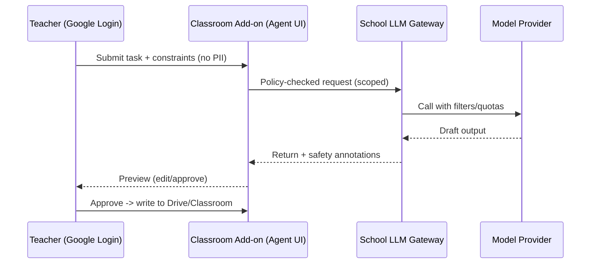

# AI Agents in Primary Education: Feasibility, Safety, and Pilot Plan

## Context and Goals
- Context: The school uses Google Classroom for communication, Docs/Slides for assignments, and managed Google accounts. PDPO compliance and student safety are mandatory.
- Goal: Determine whether and how AI “agents” can be safely incorporated to improve learning and teacher efficiency, with teacher oversight.

## What We Mean by “Agent” (Primary-Safe)
- Narrow, goal-directed assistants that operate within constrained scopes and time windows.
- Always teacher-in-the-loop for student-facing actions; no persistent autonomy.
- Examples: generate differentiated worksheets; draft parent notes; orchestrate a quiz flow; suggest feedback snippets.

## Candidate Use Cases
- Teacher-facing (recommended to start): lesson/worksheet generator; rubric/feedback assistant; question-set curator; translation aid for parent comms.
- Student-facing (pilot later): guided reading coach; math practice companion; structured research helper with source checking.
- Admin-facing: policy-aware redaction and template builder for consent/letters.

## Guardrails and Compliance
- Identity: Google SSO; OU-based policies. Teacher-only features first; student features gated by class lists/age.
- Data: minimize PII; never send full names/emails; store work in Drive with proper sharing. Disable model training on org data.
- Safety: pre- and post-filters for toxicity/inappropriate content; blocklists; rate limits; logging and review.
- Compliance: PDPO data-mapping and retention; consent (parents) for student pilots; accessibility and bilingual support.

## Architecture Options (Google-Aligned)
- Option A — Vendor-embedded assistants (Gemini in Docs/Slides/Classroom)
  - Pros: native controls, least integration effort, no new data flows. Cons: limited custom workflows.
- Excluded for now (external data handling):
  - Option B — School-managed agent via gateway (would route data to external model providers)
  - Option C — Third-party classroom agents (non-Google SaaS)

## Agent Loop (Teacher-in-the-Loop)

## Comparison Snapshot
- Security/Compliance: B > A ≥ C (B strongest with logs; A good; C varies)
- Pedagogy Fit: A/C strong out-of-the-box; B customizable to curriculum
- Effort/Cost: A lowest; C medium (licenses); B highest (build/run)

## Pilot Plan
- Phase 0 (0–1 mo): Policies, consent templates, Google Admin baselines (app restrictions, logs, Gemini controls), choose Option A + one of B/C for pilot.
- Phase 1 (2–3 mo): Teacher-facing pilots only. Scenarios: lesson planning, feedback drafting, quiz generation. 6–8 teachers, 2–3 classes.
- Phase 2 (4–6 mo): Expand subjects; add student-facing coaching in walled garden (Khanmigo or tightly constrained gateway app).
- Phase 3 (7–12 mo): Optimize; consider more tools if metrics met.

## Success Metrics
- Teacher efficiency: ≥30% prep/marking time reduction for pilot teachers.
- Quality: rubric-aligned outputs requiring ≤20% edits on average.
- Safety: zero critical incidents; logs reviewed termly; incident SLAs met.
- Adoption: ≥70% of pilot teachers using agent workflows weekly.

## Risks and Mitigations
- Hallucinations -> require previews, cite sources, teacher approval.
- Data leakage -> strict redaction; no student identifiers; Drive-only storage.
- Inappropriate content -> multi-stage safety filters; age gates; allowlists.
- Over-reliance -> training on pedagogy-first use; reflective prompts; exemplars.

## Recommendations
- Proceed with Option A (Gemini) for teacher tasks only.
- Keep all student-facing agents “assistive”, not autonomous; require teacher initiation and oversight.
- Reassess gateway/third-party options only if policies allow and data remains within approved boundaries.

## Next Steps
- Select pilot teachers/subjects and finalize scenarios.
- Configure Admin policies and logging; prepare consent and safety briefings.
- Implement add-on UI (if Option B) and connect to gateway policies.
- Schedule training and evaluation checkpoints; report results to leadership.
