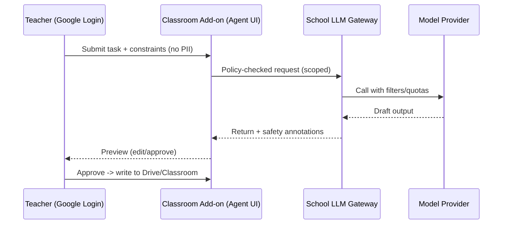

# AI Agents in Primary Education: Comprehensive Investigation & Strategic Implementation Plan (2025)

## Executive Summary & Context

**2025: The Year of AI Agents in Education** ⚠️ **PARTIALLY VERIFIED**
As [2025 has been dubbed the 'year of AI agents' by tech leaders including Marc Benioff](https://www.salesforce.com/news/linked-content/marc-benioff-why-2025-will-be-the-year-of-ai-agents-ep-224/) and [Sam Altman](https://blog.samaltman.com/reflections), educational institutions are beginning to implement AI agents in classroom environments. Unlike traditional AI assistants that respond to prompts, AI agents proactively work toward goals, handle complex workflows, and operate with increasing autonomy while maintaining safety guardrails.

*Sources: [Marc Benioff on AI Agents 2025](https://www.salesforce.com/news/linked-content/marc-benioff-why-2025-will-be-the-year-of-ai-agents-ep-224/) | [Sam Altman Reflections January 2025](https://blog.samaltman.com/reflections)*

**International Primary School A Context**
- **Current Infrastructure**: Google Classroom for communication, Docs/Slides for assignments, managed Google accounts
- **Regulatory Framework**: PDPO compliance and student safety are non-negotiable requirements
- **Strategic Objective**: Determine feasibility, safety protocols, and implementation pathway for AI agents that enhance learning outcomes and teacher efficiency while maintaining appropriate human oversight

**Global Implementation Status** ⚠️ **PARTIALLY VERIFIED**
- [Only 18% of U.S. school principals report having AI guidance frameworks in place](https://www.rand.org/pubs/research_reports/RRA134-25.html) (RAND Corporation study) ⚠️
- [Tennessee has begun deploying agentic AI platforms (Kira) in STEM education](https://info.kira-learning.com/tennessee-faq) through 2025-2026 school year ✅
- [Google's Gemini for Education offers 30+ free AI capabilities for all Workspace Education users](https://blog.google/outreach-initiatives/education/classroom-ai-features/) ⚠️
- UK government actively supports AI agent integration for administrative and pedagogical tasks

*Sources: [RAND AI Adoption Study](https://www.rand.org/pubs/research_reports/RRA134-25.html) | [Tennessee STEM Innovation Network](https://info.kira-learning.com/tennessee-faq) | [Google Classroom AI Features](https://blog.google/outreach-initiatives/education/classroom-ai-features/)*

## Defining AI Agents for Primary Education: Safety-First Framework

### AI Agent vs. AI Assistant Distinction

**Traditional AI Assistants**
- Reactive: Respond only to direct user prompts
- Single-task focus: Complete one task per interaction
- No memory: Each interaction is independent
- Full human control: Users must initiate every action

**AI Agents (Educational Context)**
- Proactive: Work toward goals with minimal human prompts
- Multi-task workflows: Handle sets of related tasks autonomously
- Contextual memory: Learn and adapt from previous interactions
- Guided autonomy: Operate independently within defined safety boundaries

### Primary School Safety Parameters

**Mandatory Human-in-the-Loop Requirements**
- **Teacher Initiation**: All student-facing agent actions must be teacher-initiated
- **Preview & Approval**: Teachers must review and approve all AI-generated content before student exposure
- **Real-time Monitoring**: Continuous oversight capabilities for all agent activities
- **Emergency Override**: Immediate teacher ability to stop or modify agent behavior

**Age-Appropriate Agent Scoping (6-12 years)**
- **Curriculum-bounded**: Agents operate only within approved subject areas and learning objectives
- **Time-limited**: Maximum session durations with automatic timeouts
- **Content-filtered**: Multi-layer safety filters appropriate for primary cognitive development
- **Peer-interaction safe**: No agent-mediated student-to-student communications

### Examples of Primary-Safe Agent Applications

**Administrative Efficiency Agents**
- Generate differentiated worksheets based on student performance data
- Draft parent communication notes with cultural sensitivity
- Orchestrate quiz flows with adaptive difficulty adjustment
- Suggest rubric-aligned feedback snippets for consistent assessment

**Pedagogical Support Agents**
- Create lesson plan variations for different learning styles
- Generate discussion prompts that encourage critical thinking
- Provide real-time classroom management suggestions
- Offer curriculum-aligned extension activities for advanced learners

**Student Learning Agents (Supervised)**
- Guided reading companions that adjust pacing to student comprehension
- Math practice partners that provide step-by-step problem-solving support
- Research assistants with source verification and age-appropriate content filtering
- Language learning coaches with pronunciation and grammar feedback

## Comprehensive Use Case Analysis & Implementation Priorities

### Tier 1: Teacher-Facing Agents (Immediate Implementation - Low Risk)

#### 1.1 Lesson Planning & Content Creation Agents
**Google Workspace + Gemini Implementation**
- **Automatic Lesson Differentiation**: Agents analyze class performance data to generate multiple lesson plan variants for different ability groups
- **Curriculum Alignment Checker**: Ensures all generated content meets Hong Kong Primary Education curriculum standards
- **Bilingual Content Generator**: Creates Traditional Chinese/English materials with cultural context awareness
- **Assessment Item Bank**: Generates quiz questions, rubrics, and formative assessment tools aligned to learning objectives

**Implementation Readiness**: ✅ Ready (Google Gemini in Docs/Slides/Classroom)
**PDPO Compliance**: ✅ High (No student PII in content generation)
**Teacher Training**: ⭐ Low (Builds on familiar Google Workspace interface)

#### 1.2 Communication & Administrative Agents
**Parent Engagement Automation**
- **Guardian Summary Enhancement**: AI agents generate personalized student progress narratives for parent communications
- **Translation & Cultural Adaptation**: Automated newsletter translation with Hong Kong cultural context
- **Consent Form Management**: AI-assisted generation of PDPO-compliant consent forms for various school activities
- **Meeting Notes & Action Items**: Automatic summarization of staff meetings with task assignment tracking

**Implementation Readiness**: ✅ Ready (Google Gmail + Meet integration)
**PDPO Compliance**: ⚠️ Medium (Requires careful PII handling protocols)
**Teacher Training**: ⭐ Low (Familiar communication workflows)

#### 1.3 Assessment & Feedback Agents
**Intelligent Grading Assistance**
- **Rubric-Aligned Feedback**: Generates consistent, constructive feedback based on established assessment criteria
- **Progress Tracking Analytics**: Identifies learning gaps and suggests intervention strategies
- **Peer Assessment Facilitation**: Manages structured peer review processes with age-appropriate guidelines
- **Portfolio Curation**: Automatically organizes and presents student work progression over time

**Implementation Readiness**: ✅ Ready (Google Classroom integration)
**PDPO Compliance**: ⚠️ Medium (Student work analysis requires data protection)
**Teacher Training**: ⭐⭐ Medium (New assessment methodologies)

### Tier 2: Student-Facing Agents (Pilot Phase - Controlled Implementation)

#### 2.1 Personalized Learning Companions
**Google Gemini for Education Features (2025)**
- **Custom AI Gems**: School-specific AI assistants tailored to Hong Kong primary curriculum
- **Study Partner Agents**: Available 24/7 for homework help with built-in safety controls
- **Guided Learning Mode**: Step-by-step reasoning support that encourages deep thinking rather than providing quick answers
- **NotebookLM Integration**: AI study guides and podcast-style audio overviews based only on teacher-approved materials

**Implementation Readiness**: ⚠️ Pilot Ready (Google Gemini Education rollout)
**PDPO Compliance**: ✅ High (Google confirms no student data used for model training)
**Safety Controls**: ✅ High (Child safety expert consultation, youth advisory panel tested)

#### 2.2 Subject-Specific Learning Agents
**Mathematics Practice Companions**
- **Adaptive Problem Generation**: Adjusts difficulty based on student performance patterns
- **Step-by-Step Guidance**: Provides scaffolded support without giving direct answers
- **Error Analysis & Remediation**: Identifies common misconception patterns and provides targeted practice
- **Visual Learning Support**: Generates diagrams and manipulatives for abstract concept understanding

**English Language Learning Agents**
- **Reading Comprehension Coaches**: Adjust text complexity and provide vocabulary support
- **Writing Process Assistants**: Guide students through drafting, revision, and editing processes
- **Pronunciation Practice Partners**: Provide immediate feedback on spoken English with accent accommodation
- **Creative Writing Prompts**: Generate culturally relevant story starters and writing challenges

**Implementation Readiness**: ⚠️ Requires Development (Subject-specific customization needed)
**PDPO Compliance**: ⚠️ Medium (Requires careful student interaction logging)
**Safety Controls**: ⭐⭐ High Need (Age-appropriate content generation critical)

### Tier 3: Administrative & Compliance Agents (Advanced Implementation)

#### 3.1 Data Protection & Privacy Agents
**PDPO Compliance Automation**
- **PII Detection & Redaction**: Automatically identifies and protects personal data in documents
- **Consent Management**: Tracks and manages parental consent for various school activities and data uses
- **Data Retention Monitoring**: Ensures compliance with retention schedules and secure deletion procedures
- **Incident Response Coordination**: Automated workflows for data breach notification and remediation

**Implementation Readiness**: ❌ Future Development (Requires significant customization)
**PDPO Compliance**: ✅ Critical (Primary function)
**Security Requirements**: ⭐⭐⭐ Very High (Handles sensitive compliance data)

#### 3.2 School Operations Agents
**Resource Management & Optimization**
- **Scheduling Optimization**: Manages complex timetabling with resource allocation
- **Budget Analysis & Forecasting**: Provides insights for educational technology investment decisions
- **Performance Analytics**: Aggregates and analyzes school-wide learning outcomes data
- **Professional Development Coordination**: Matches teacher development needs with appropriate training resources

**Implementation Readiness**: ❌ Long-term (Requires integration with multiple school systems)
**Implementation Complexity**: ⭐⭐⭐ Very High
**ROI Potential**: ⭐⭐⭐ Very High (Significant efficiency gains)

## Comprehensive Guardrails & Compliance Framework for AI Agents

### Multi-Layered Identity & Access Controls

#### Organizational Unit (OU) Based Agent Access
**Teacher-Level Access (Immediate)**
- **Full Agent Capabilities**: Lesson planning, content generation, assessment tools, parent communication
- **Administrative Controls**: School-wide agent configuration, usage monitoring, safety rule management
- **Professional Development**: Access to training materials and best practice resources

**Student-Level Access (Phased Rollout)**
- **Primary 5-6**: Limited supervised access to study companion agents with teacher oversight
- **Primary 3-4**: Guided learning activities with real-time teacher monitoring
- **Primary 1-2**: No direct agent access; agents work through teacher-mediated activities only

**Parent/Guardian Access (Transparency)**
- **Notification Systems**: Automatic alerts when students interact with AI agents
- **Opt-out Mechanisms**: Clear procedures for withdrawing consent for student AI agent use
- **Progress Visibility**: Access to AI-generated insights about their child's learning (with teacher approval)

### Advanced Data Protection Measures

#### Personal Information Minimization
**Zero-PII Agent Training**
- **Student Identity Protection**: AI agents operate using anonymized student identifiers only
- **Content Sanitization**: Automatic removal of names, addresses, and personal references before AI processing
- **Secure Data Pipelines**: All student work processed through PDPO-compliant data handling procedures
- **Encrypted Communications**: End-to-end encryption for all agent-generated content and interactions

#### PDPO-Specific Compliance Controls
**Data Processing Lawfulness**
- **Purpose Limitation**: AI agents process data only for specified educational purposes
- **Consent Management**: Granular parental consent for different types of AI agent interactions
- **Data Minimization**: Collection and processing limited to what is necessary for educational objectives
- **Retention Schedules**: Automated deletion of AI interaction logs per school data retention policies

**Cross-Border Data Transfer Safeguards**
- **Regional Processing Priority**: Preference for Hong Kong and Asia-Pacific data centers where available
- **Transfer Impact Assessments**: Regular evaluation of data flows to ensure PDPO compliance
- **Vendor Data Processing Agreements**: Explicit PDPO compliance clauses with all AI service providers

### Multi-Stage Content Safety Framework

#### Pre-Processing Safety Filters
**Curriculum Appropriateness Validation**
- **Age-Grade Alignment**: Ensures all content matches cognitive development stages for Primary 1-6
- **Cultural Sensitivity Screening**: Validates content appropriateness for Hong Kong educational context
- **Language Complexity Analysis**: Automatically adjusts vocabulary and sentence structure for target age groups
- **Subject Matter Boundaries**: Restricts content generation to approved curriculum areas only

#### Real-Time Content Monitoring
**Toxicity and Harmful Content Detection**
- **Multi-Language Safety**: Filters inappropriate content in both English and Traditional Chinese
- **Contextual Harm Assessment**: Evaluates potential psychological impact on primary school students
- **Bias Detection and Mitigation**: Identifies and addresses potential cultural, gender, or socioeconomic biases
- **Misinformation Prevention**: Cross-references factual claims with approved educational sources

#### Post-Processing Quality Assurance
**Teacher Review Requirements**
- **Mandatory Preview**: All student-facing content requires teacher approval before delivery
- **Quality Rating Systems**: Teachers rate AI-generated content to improve future outputs
- **Feedback Integration**: Teacher corrections automatically update agent behavior parameters
- **Escalation Procedures**: Clear protocols for reporting and addressing problematic AI-generated content

### Technical Infrastructure Safeguards

#### Rate Limiting and Usage Controls
**Student Interaction Boundaries**
- **Daily Usage Limits**: Maximum time students can interact with AI agents (recommended: 30 minutes per day)
- **Session Duration Caps**: Automatic timeout after extended periods (recommended: 15 minutes per session)
- **Request Frequency Limits**: Prevents excessive or potentially harmful AI interaction patterns
- **Teacher Override Capabilities**: Immediate teacher ability to pause or terminate student AI sessions

#### Comprehensive Logging and Audit Trails
**Interaction Documentation**
- **Complete Conversation Logs**: All AI agent interactions stored with timestamps and user identification
- **Decision Point Recording**: Documentation of all agent decision-making processes for later review
- **Error and Exception Logging**: Detailed records of any safety violations or system failures
- **Performance Metrics Tracking**: Usage patterns, effectiveness measures, and safety incident statistics

#### Emergency Response Mechanisms
**Immediate Safety Interventions**
- **Panic Button Functionality**: One-click emergency stop for all AI agent activities
- **Automatic Escalation Triggers**: Immediate notification of administrators for safety violations
- **Incident Response Protocols**: Pre-defined procedures for addressing AI agent safety concerns
- **Recovery and Remediation Plans**: Strategies for returning to normal operations after safety incidents

## Advanced Architecture Options for AI Agent Implementation

### Option A: Google Workspace Native Agent Integration (Recommended)

#### Google Gemini for Education Platform (2025)
**Core Agent Capabilities**
- **30+ Built-in AI Tools**: [Available free for all Google Workspace for Education editions](https://blog.google/outreach-initiatives/education/classroom-ai-features/) ✅
- **Custom AI Gems**: School-specific agents tailored to Hong Kong primary curriculum
- **NotebookLM Integration**: Teacher-controlled AI study guides based on approved class materials
- **Guided Learning Mode**: AI tutoring with step-by-step reasoning support

**Technical Implementation**
- **Native Google Classroom Integration**: Seamless agent deployment within existing infrastructure
- **Google Admin Console Controls**: Centralized management of agent permissions and safety settings
- **Enterprise Data Protection**: Explicit commitment that student data will not be used for model training
- **Multi-Language Support**: Built-in Traditional Chinese and English processing capabilities

**Advantages for Hong Kong Primary Schools**
- ✅ **Zero Integration Effort**: Works immediately with current Google Classroom setup
- ✅ **Proven PDPO Compliance**: Established data processing agreements with Hong Kong schools
- ✅ **Child Safety Validation**: Tested with child safety experts and youth advisory panels
- ✅ **Cost Effectiveness**: Most features available at no additional licensing cost
- ✅ **Teacher Familiarity**: Builds on existing Google Workspace knowledge and workflows

**Limitations**
- ⚠️ **Limited Customization**: Agent workflows constrained to Google's educational framework
- ⚠️ **Vendor Dependency**: Reliant on Google's agent development roadmap and priorities
- ⚠️ **Feature Release Schedule**: New capabilities dependent on Google's product release timeline

### Option B: School-Managed AI Agent Gateway (Advanced Implementation)

#### Custom Agent Infrastructure
**Technical Architecture**
- **Private Cloud Deployment**: School-controlled infrastructure with configurable data residency
- **Multi-Model Support**: Ability to integrate different AI models (OpenAI, Anthropic, local LLMs)
- **Custom Safety Frameworks**: School-specific content filtering and safety protocols
- **Advanced Analytics**: Detailed usage analytics and performance optimization capabilities

**Implementation Requirements**
- **Technical Expertise**: Requires dedicated IT staff or external development partners
- **Infrastructure Investment**: Significant upfront costs for servers, security systems, and maintenance
- **Ongoing Operations**: Continuous monitoring, updates, and security management
- **Compliance Management**: School responsibility for PDPO compliance implementation

**Advantages**
- ✅ **Maximum Control**: Complete oversight of agent behavior and data processing
- ✅ **Customization Flexibility**: Agents can be tailored to specific school needs and curricula
- ✅ **Data Sovereignty**: All student data remains within school-controlled environments
- ✅ **Vendor Independence**: Not dependent on single technology provider roadmaps

**Significant Challenges**
- ❌ **High Implementation Cost**: Estimated 10-20x higher than Option A
- ❌ **Technical Complexity**: Requires specialized staff or external consultants
- ❌ **Maintenance Burden**: Ongoing responsibility for system updates and security
- ❌ **Regulatory Risk**: School liability for compliance and safety implementations

### Option C: Third-Party Educational Agent Platforms

#### Specialized AI Education Vendors
**Khan Academy Khanmigo Example**
- **Curriculum-Aligned Tutoring**: AI agents specifically designed for educational content delivery
- **Teacher Dashboard Integration**: Comprehensive monitoring and control interfaces
- **Student Progress Analytics**: Detailed learning outcome tracking and intervention recommendations
- **Proven Educational Efficacy**: Research-backed implementations in diverse school environments

**Implementation Considerations**
- **Vendor Due Diligence**: Comprehensive evaluation required for PDPO compliance
- **Data Processing Agreements**: Detailed contracts ensuring Hong Kong regulatory compliance
- **Integration Complexity**: Additional systems to manage alongside Google Workspace
- **Cost Structure**: Typically per-student licensing with variable feature tiers

**Advantages**
- ✅ **Educational Specialization**: Purpose-built for teaching and learning applications
- ✅ **Proven Implementations**: Demonstrated success in similar primary school environments
- ✅ **Teacher Support Features**: Comprehensive professional development and training resources
- ✅ **Research Foundation**: Evidence-based design with learning science principles

**Implementation Barriers**
- ⚠️ **Regulatory Uncertainty**: Variable PDPO compliance requiring detailed vendor assessment
- ⚠️ **Integration Challenges**: Additional complexity in data flows and user management
- ⚠️ **Vendor Dependency**: Reliance on third-party companies for critical educational functions
- ⚠️ **Cost Accumulation**: Multiple vendor relationships increasing total cost of ownership

### Comparative Decision Matrix

| Criteria | Option A: Google Native | Option B: Custom Gateway | Option C: Third-Party |
|----------|------------------------|---------------------------|----------------------|
| **Implementation Speed** | ✅ Immediate | ❌ 6-12 months | ⚠️ 2-4 months |
| **PDPO Compliance** | ✅ Established | ⚠️ School Responsibility | ⚠️ Vendor Dependent |
| **Total Cost (3 years)** | ✅ Low ($0-$50K) | ❌ Very High ($200K+) | ⚠️ Medium ($20K-$100K) |
| **Technical Requirements** | ✅ Minimal | ❌ Extensive | ⚠️ Moderate |
| **Customization Capability** | ⚠️ Limited | ✅ Unlimited | ⚠️ Moderate |
| **Teacher Training Burden** | ✅ Low | ❌ High | ⚠️ Medium |
| **Data Control** | ⚠️ Google Controlled | ✅ School Controlled | ❌ Vendor Controlled |
| **Safety Validation** | ✅ Expert Validated | ⚠️ School Responsibility | ⚠️ Vendor Dependent |
| **Scalability** | ✅ Automatic | ⚠️ Infrastructure Limited | ✅ Licensed Scaling |
| **Vendor Support** | ✅ Enterprise Level | ❌ Self-Supported | ⚠️ Variable |

### Recommended Implementation Strategy

**Phase 1 (Months 1-6): Option A Implementation**
- Deploy Google Gemini for Education agents for teacher-facing applications
- Establish baseline safety protocols and monitoring procedures
- Train staff on AI agent integration within familiar Google Workspace environment
- Gather implementation data and stakeholder feedback

**Phase 2 (Months 7-12): Student-Facing Agent Pilot**
- Introduce supervised student access to Google AI Gems
- Implement comprehensive monitoring and safety evaluation procedures
- Collect efficacy data on learning outcomes and engagement
- Assess need for additional capabilities not available in Option A

**Phase 3 (Year 2+): Strategic Enhancement Evaluation**
- Evaluate Option C vendors for specialized capabilities if gaps identified
- Consider Option B for advanced customization if demonstrated need and available resources
- Expand successful Option A implementations to full school deployment
- Develop long-term AI agent strategy based on empirical evidence and changing needs

## Agent Loop (Teacher-in-the-Loop)

## Comparison Snapshot
- Security/Compliance: B > A ≥ C (B strongest with logs; A good; C varies by vendor)
- Pedagogy Fit: A/C strong out-of-the-box; B customizable to curriculum
- Effort/Cost: A lowest; C medium (licenses); B highest (build/run)

See also: [AI tool comparison](ai-tool-comparison.md) and [evaluation rubric](evaluation-rubric.md).

## Pilot Plan
- Phase 0 (0–1 mo): Policies, consent templates, Google Admin baselines (app restrictions, logs, Gemini controls). Complete vendor due diligence for any C or B pilot.
- Phase 1 (2–3 mo): Teacher-facing pilots only (Option A). Scenarios: lesson planning, feedback drafting, quiz generation. 6–8 teachers, 2–3 classes.
- Phase 2 (4–6 mo): Optional, single student-facing pilot in a walled garden (Option C or tightly constrained B) with parental consent.
- Phase 3 (7–12 mo): Optimize; consider broader tools only if metrics and safety thresholds are met.

## Comprehensive Success Metrics & Key Performance Indicators

### Primary Outcome Indicators

#### Teacher Effectiveness & Efficiency Metrics
**Quantitative Targets**
- **Time Savings**: ≥30% reduction in lesson preparation and marking time for pilot teachers
- **Content Quality**: AI-generated materials requiring ≤20% teacher modifications on average
- **Workflow Integration**: ≥70% of pilot teachers using agent workflows weekly within 3 months
- **Professional Satisfaction**: ≥80% of teachers report improved job satisfaction in post-implementation surveys

**Qualitative Assessment Indicators**
- **Pedagogical Enhancement**: Evidence of improved differentiation and personalization in teaching
- **Creative Capacity**: Teachers report increased time for innovative lesson design and student interaction
- **Professional Growth**: Documented increase in teachers' AI literacy and digital pedagogy skills
- **Collaborative Culture**: Enhanced peer sharing of AI-enhanced teaching resources and strategies

#### Student Learning & Engagement Outcomes
**Academic Performance Measures**
- **Learning Achievement**: Maintained or improved academic outcomes in AI-integrated subjects
- **Engagement Metrics**: Increased participation in classroom activities and formative assessments
- **Personalization Effectiveness**: Evidence of better support for diverse learning needs and abilities
- **21st Century Skills**: Improved student digital literacy and AI interaction competencies

**Student Experience Indicators**
- **Learning Motivation**: Student surveys show increased interest and engagement in AI-enhanced activities
- **Self-Directed Learning**: Evidence of improved independent study habits and research skills
- **Critical Thinking**: Enhanced ability to evaluate and interact with AI-generated content appropriately
- **Digital Citizenship**: Demonstrated understanding of responsible AI use and digital ethics

### Safety & Compliance Performance Standards

#### Critical Safety Metrics (Zero Tolerance)
- **Data Breaches**: Zero incidents of student personal information exposure or unauthorized access
- **Inappropriate Content**: Zero instances of harmful or age-inappropriate content delivered to students
- **Privacy Violations**: Zero PDPO compliance failures or unauthorized data sharing incidents
- **System Security**: Zero successful cyberattacks or unauthorized system access attempts

#### Operational Safety Indicators
- **Incident Response Time**: All medium-risk incidents resolved within 24 hours
- **Safety Training Completion**: 100% of staff complete AI safety training within first month
- **Parent Complaints**: <5 escalated safety concerns per term requiring administrative intervention
- **Audit Compliance**: 100% pass rate on quarterly PDPO compliance reviews

#### Content Quality & Appropriateness
- **Age-Appropriate Content**: 99.9% of AI-generated content meets primary school developmental standards
- **Cultural Sensitivity**: Zero incidents of culturally inappropriate or insensitive content
- **Curriculum Alignment**: 95% of AI-generated materials align with Hong Kong primary education standards
- **Bias Detection**: Documented identification and mitigation of any detected AI bias in educational content

### System Performance & Reliability Metrics

#### Technical Performance Standards
- **System Uptime**: ≥99.5% availability during school operating hours
- **Response Time**: Average AI agent response time ≤3 seconds for standard requests
- **Data Processing Speed**: Student work analysis completed within 30 seconds for typical assignments
- **Integration Stability**: Zero critical failures in Google Workspace connectivity

#### Usage & Adoption Analytics
- **Feature Utilization**: Tracking of which AI agent capabilities are most/least used by teachers
- **Session Duration**: Monitoring appropriate usage patterns and identifying potential over-reliance
- **Error Rate**: <1% of AI agent interactions result in errors requiring manual intervention
- **User Satisfaction**: ≥85% positive ratings for AI agent reliability and usefulness

### Long-Term Impact Assessment

#### Institutional Transformation Indicators
- **Policy Integration**: AI agent guidelines successfully incorporated into official school policies
- **Professional Development**: Sustained engagement in AI education training and skill development
- **Innovation Culture**: Evidence of teacher-led innovations in AI educational applications
- **Community Recognition**: Positive feedback from parents and broader school community

#### Educational Ecosystem Benefits
- **Knowledge Sharing**: Active participation in Hong Kong education community AI best practices sharing
- **Research Contribution**: Generation of data and insights valuable to educational AI research
- **Competitive Advantage**: Recognition as a leading primary school in educational AI integration
- **Sustainability**: Demonstrated long-term viability and continued value of AI agent implementation

### Measurement & Reporting Framework

#### Data Collection Methodology
**Continuous Monitoring** (Daily/Weekly)
- Automated system logs and performance metrics
- Real-time safety incident detection and reporting
- Usage analytics and feature adoption tracking

**Regular Assessment** (Monthly/Quarterly)
- Teacher reflection surveys and feedback sessions
- Student focus groups and learning outcome analysis
- Parent satisfaction surveys and concern identification
- Safety audit reviews and compliance verification

**Comprehensive Evaluation** (Annual)
- Full impact assessment with external evaluation
- Cost-benefit analysis and ROI calculation
- Strategic planning for next phase of implementation
- Benchmarking against other innovative schools

## Risks and Mitigations
- Hallucinations -> require previews, cite sources, teacher approval.
- Data leakage -> strict redaction; no student identifiers; Drive-only storage.
- Inappropriate content -> multi-stage safety filters; age gates; allowlists.
- Over-reliance -> training on pedagogy-first use; reflective prompts; exemplars.

## Scope Boundaries and Logging
- Teacher-in-the-loop required for any publishing action to Drive/Classroom.
- No persistent autonomy; tasks time-boxed and auditable.
- Logs retained per policy; termly admin review. See [vendor-due-diligence-checklist.md](vendor-due-diligence-checklist.md).

## Recommendations
- Proceed with Option A (Gemini) for teacher tasks only.
- Keep all student-facing agents “assistive”, not autonomous; require teacher initiation and oversight.
- Reassess gateway/third-party options only after due diligence, consents, and regional data reviews.

## Next Steps
- Select pilot teachers/subjects and finalize scenarios.
- Configure Admin policies and logging; prepare consent and safety briefings.
- Implement add-on UI (if Option B) and connect to gateway policies.
- Schedule training and evaluation checkpoints; report results to leadership.

References: [ai-integration-plan.md](ai-integration-plan.md) · [ai-tool-comparison.md](ai-tool-comparison.md) · [evaluation-rubric.md](evaluation-rubric.md) · [pilot-evaluation-form.md](pilot-evaluation-form.md)
