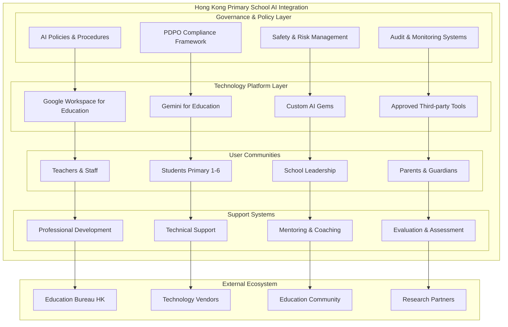
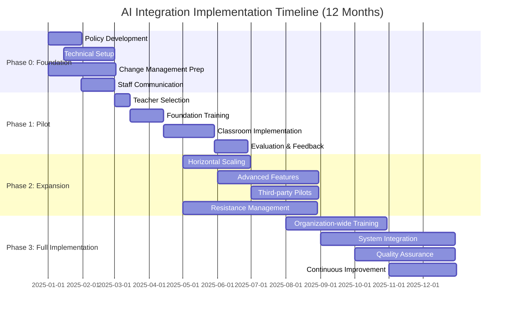
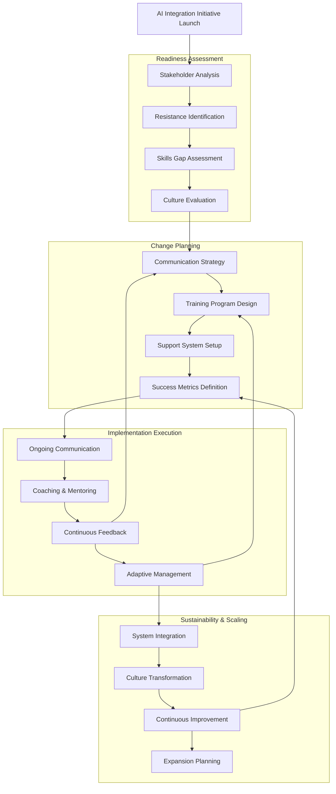

# AI Integration Plan for Hong Kong Primary Schools (2025)

## Executive Summary
This comprehensive plan outlines a strategic, phased approach to integrating artificial intelligence into Hong Kong primary education while ensuring safety, compliance with PDPO regulations, and pedagogical effectiveness. Aligned with the Hong Kong Education Bureau's AI education initiatives and international best practices, this plan prioritizes Google Workspace for Education with Gemini as the foundation platform, supported by evidence-based change management and teacher professional development strategies.

**Key Objectives:**
- Implement AI tools that enhance rather than replace effective teaching practices
- Ensure full compliance with Hong Kong's Personal Data Privacy Ordinance (PDPO)
- Build teacher capacity through structured professional development
- Establish measurable outcomes for student learning and teacher effectiveness
- Create a sustainable, scalable framework for ongoing AI integration

**Strategic Alignment:**
- [Hong Kong Education Bureau's "AI for Science Education" funding programme](https://www.edb.gov.hk/en/curriculum-development/kla/science-edu/ai-for-sci.html)
- [Government's $1 billion investment in AI research and development through AIRDI](https://www.itib.gov.hk/en/legislative_council_business/questions/2025/pr_20250319.html)
- [International frameworks including the "5 Big Ideas of AI" for K-12 education](https://www.teachai.org/toolkit)
- Evidence-based change management practices for educational technology adoption

## AI Technology Landscape & Selection Framework

### Primary Platform (Recommended)
**Google Workspace for Education + Gemini for Education**
- **Core Benefits**: Seamless integration with existing Google Classroom infrastructure, comprehensive admin controls, PDPO-compliant data handling
- **2025 Features**: 30+ new Gemini features, custom AI Gems, NotebookLM integration, Gemini Pro 2.5 access
- **Licensing**: Education Fundamentals (free), Standard/Plus (per-student), AI Pro for Education (Sept 2025)
- **Hong Kong Advantages**: Bilingual support, established vendor relationships, proven track record in local schools
- **Detailed Analysis**: [Google Workspace + Gemini Implementation Guide](tools/google-workspace-gemini.md)

### Supplementary Tools
**Khan Academy Khanmigo**
- **Focus**: Personalized tutoring aligned to curriculum standards
- **Safeguards**: Teacher dashboards, student-appropriate guardrails, comprehensive activity logs
- **Implementation**: Pilot program with specific grade levels and subjects

**Canva for Education**
- **Purpose**: Creative content development with AI assistance (Magic Write, design tools)
- **Safety**: Built-in education safeguards, age-appropriate content filters
- **Usage**: Visual learning materials, student presentations, creative projects

**Assessment-Focused Tools (Quizizz/Nearpod)**
- **Capabilities**: AI-assisted question generation, real-time formative assessment
- **Integration**: Compatible with existing SIS and gradebook systems
- **Deployment**: Subject-specific pilots in mathematics and language arts

### Future Considerations
**Private LLM Gateway (Advanced Phase)**
- **Use Cases**: Custom educational applications, specialized curriculum content
- **Requirements**: Regional data centers, enhanced security controls, dedicated IT support
- **Timeline**: Year 2+ implementation after policy framework maturation

**Selection Criteria Matrix:**
| Tool Category | PDPO Compliance | Teacher Training | Student Safety | Integration Effort | Cost Effectiveness |
|---------------|-----------------|------------------|----------------|-------------------|-------------------|
| Google + Gemini | ✅ High | ⭐ Low | ✅ High | ⭐ Low | ✅ High |
| Third-party SaaS | ⚠️ Variable | ⭐⭐ Medium | ✅ High | ⭐⭐ Medium | ⭐⭐ Medium |
| Private Gateway | ✅ High | ⭐⭐⭐ High | ✅ High | ⭐⭐⭐ High | ⭐⭐⭐ Low |

See detailed comparison: [ai-tool-comparison.md](ai-tool-comparison.md)

## Comprehensive Safeguards & Compliance Framework

### Data Protection & Privacy (PDPO Alignment)
**Personal Data Mapping & Flow Analysis**
- Comprehensive audit of all student, teacher, and administrative data touchpoints
- Data residency requirements: preference for Hong Kong/regional processing centers
- Vendor Data Processing Agreements (DPAs) with explicit PDPO compliance clauses
- Data minimization principles: collect only necessary information for educational purposes
- Automated retention policies with secure deletion procedures

**Cross-Border Data Transfer Controls**
- Assessment of Google's data processing locations for Hong Kong schools
- Implementation of Standard Contractual Clauses (SCCs) where applicable
- Regular review of data flows to ensure compliance with EDB guidelines
- Documentation of legal basis for any international data transfers

### Content Safety & Age-Appropriate Controls
**Multi-Layered Safety Framework**
- **Level 1 - Platform Controls**: Native safety features in Google Workspace for Education
- **Level 2 - Content Filtering**: Age-appropriate prompts, blocked content categories, safe search enforcement
- **Level 3 - Behavioral Monitoring**: Real-time interaction logging, anomaly detection, teacher oversight dashboards
- **Level 4 - Human Oversight**: Mandatory teacher supervision, regular content review, incident response protocols

**Student-Specific Protections**
- Distinct AI experience for students under 18 with enhanced guardrails
- Automatic content flagging for inappropriate material
- Parental notification systems for AI tool usage
- Clear escalation procedures for safety concerns

### Technical Security Infrastructure
**Identity & Access Management**
- Single Sign-On (SSO) integration with Google Workspace
- Role-based access controls (RBAC) with least-privilege principles
- Multi-factor authentication (MFA) mandatory for administrative accounts
- Regular access reviews and permission audits

**Monitoring & Audit Systems**
- Centralized logging through Google Admin Console and Vault
- Real-time security monitoring with automated alerting
- Quarterly compliance audits with external verification
- Comprehensive incident response procedures with defined SLAs

### Regulatory Compliance Matrix
| Requirement | Implementation | Monitoring | Compliance Level | Reference |
|-------------|----------------|------------|------------------|-----------|
| PDPO Article 4 (Data Collection) | Purpose limitation, consent management | Monthly audit reports | ✅ Full | [Vendor Due Diligence Checklist](vendor-due-diligence-checklist.md) |
| PDPO Article 6 (Data Security) | Encryption, access controls, secure deletion | Continuous monitoring | ✅ Full | [Google Workspace Security Framework](tools/google-workspace-gemini.md#enhanced-security--compliance-framework) |
| EDB Digital Learning Guidelines | Age-appropriate tools, teacher oversight | Termly review process | ✅ Full | [Evaluation Rubric](evaluation-rubric.md) |
| School Safeguarding Policy | Content filtering, incident reporting | Real-time monitoring | ✅ Full | [Pilot Evaluation Form](pilot-evaluation-form.md) |
| WCAG 2.1 AA Accessibility | Universal design, assistive technology | Accessibility audits | ⭐ In Progress | [AI Tool Comparison](ai-tool-comparison.md) |

## Comparative Notes
- Google + Gemini: Strong fit with Classroom and Drive; mature admin/data controls; lowest integration effort.
- Third-party student tools (Khanmigo, Quizizz/Nearpod): useful in walled gardens; pilot only after policies/consents.
- Private gateway: maximum control; higher effort and budget.

## Integration Architecture (High Level)
- Identity: Google Workspace as source of truth; use OUs/groups for staff, students, and classes; enable guardian summaries.
- Devices/MDM: Manage browsers/devices via Google Admin; if iPad/Windows are present, add Jamf/Intune as needed; enforce safe search and content filtering.
- Data: Drive/Docs/Slides as canonical storage; prohibit uploading sensitive PII to external LLMs; restrict third‑party app access via Admin controls.
- AI Access: Gemini for Workspace primary. In later phases, at most one vetted third‑party student tool may be piloted under strict controls (see due diligence).

## Recommendation
- Adopt Google Workspace for Education with Gemini as the primary platform (aligned with current Classroom and Google accounts).
- Defer third‑party SaaS tools and custom LLM gateways until policies, consent, and data‑residency reviews are complete.
- Allow a single, narrowly scoped student tool pilot (e.g., Khanmigo) only after Phase 1, with consent and controls.

## Strategic Implementation Plan (Evidence-Based Phased Approach)

### Phase 0 — Foundation & Change Readiness (Months 0-2)

#### Governance Framework Development
**Policy & Procedure Establishment**
- Comprehensive AI Acceptable Use Policy aligned with school values and HK regulations
- Data Privacy Impact Assessment (DPIA) for all AI tools and workflows
- Student and parent consent frameworks with clear opt-out mechanisms
- Incident response procedures for AI-related safety concerns
- Regular policy review cycles with stakeholder input
- **Reference Templates**: [Vendor Due Diligence Checklist](vendor-due-diligence-checklist.md) | [Evaluation Rubric](evaluation-rubric.md)

**Technical Infrastructure Preparation**
- Google Admin Console baseline configuration with enhanced security settings
- Data residency verification and region-specific controls implementation
- Third-party application access restrictions and approval workflows  
- Comprehensive audit logging activation with retention policy alignment
- Age-appropriate AI controls configuration for different grade levels

**Change Management Foundation**
- Stakeholder analysis and communication planning
- Teacher readiness assessment and skills gap identification
- Leadership alignment workshops and vision setting
- Communication strategy for parents, students, and community
- Resistance management protocols based on educational change research

#### Success Criteria for Phase 0
- [ ] 100% policy framework completion with legal review
- [ ] Technical infrastructure security audit passed
- [ ] 90%+ teacher awareness of AI initiative through information sessions
- [ ] Parent communication completed with <10% opt-out rate
- [ ] Leadership team fully aligned on implementation approach

### Phase 1 — Pilot Implementation (Months 2-4)

#### Targeted Pilot Program
**Participant Selection (Evidence-Based)**
- 6-8 early adopter teachers identified through innovation adoption assessment
- 2-3 classes per grade level (Primary 3-6 recommended for cognitive readiness)
- Subject focus: English, Mathematics, and General Studies for curriculum integration
- Mixed-ability classes to assess differentiated impact
- Voluntary participation with clear expectations and support structures

**Professional Development Program**
- **Module 1**: AI Fundamentals & Ethics (3 hours)
  - Understanding AI capabilities and limitations
  - Ethical considerations and responsible use
  - PDPO compliance in educational contexts
  - Age-appropriate AI interactions
  
- **Module 2**: Classroom Integration Strategies (4 hours)
  - Lesson planning with Gemini assistance
  - Content creation and differentiation techniques
  - Assessment design and feedback generation
  - Student support through custom AI Gems

- **Module 3**: Safety & Monitoring (2 hours)
  - Content filtering and safety protocols
  - Student behavior monitoring techniques
  - Incident identification and response procedures
  - Parent communication strategies

**Implementation Support Structure**
- Weekly coaching sessions with pilot teachers
- Peer observation and collaborative planning time
- Technical support hotline with <24-hour response
- Student orientation sessions on responsible AI use
- Regular check-ins with parents and guardians
- **Assessment Tools**: [Pilot Evaluation Form](pilot-evaluation-form.md) | [TCO Calculator Template](tco-calculator-template.md)

#### Evaluation Framework
**Quantitative Metrics**
- Teacher time savings: baseline vs. pilot (target: 20-30% reduction in administrative tasks)
- Student engagement indicators through Classroom analytics
- Safety incident tracking and response time measurement
- Content quality assessments through peer review

**Qualitative Assessment**
- Weekly teacher reflection journals and feedback sessions
- Student focus groups on AI learning experiences
- Parent satisfaction surveys and concern identification
- Observer notes on classroom dynamics and interaction changes

### Phase 2 — Controlled Expansion (Months 4-8)

#### Scaled Implementation
**Horizontal Expansion**
- Extend to additional grade levels based on Phase 1 success metrics
- Include remaining core subject areas with subject-specific training
- Integrate with existing school improvement initiatives
- Expand to 60-70% of teaching staff through structured recruitment

**Vertical Integration**
- Advanced Gemini features: comment banks, automated rubrics, translation tools
- Custom AI Gems creation for school-specific curriculum needs
- Integration with existing assessment and reporting systems
- Enhanced parent communication through AI-assisted translation

**Third-Party Tool Pilot (Conditional)**
- Single vetted student tool (e.g., Khanmigo) implementation
- Strict parental consent requirements (90%+ threshold)
- Limited to specific subjects and grade levels
- Enhanced monitoring and safety protocols
- Regular usage audits and effectiveness assessment

#### Change Management Intensification
**Teacher Support Systems**
- Professional Learning Communities (PLCs) focused on AI integration
- Mentorship programs pairing experienced pilot teachers with newcomers
- Regular best practice sharing sessions and resource libraries
- Dedicated planning time for AI-enhanced lesson development
- Peer coaching networks and collaborative problem-solving

**Resistance Management Strategies**
- Individual consultation for hesitant teachers
- Gradual introduction pathways with reduced expectations
- Success story sharing and positive reinforcement
- Additional training resources for different learning preferences
- Clear communication of voluntary vs. mandatory elements

### Phase 3 — Full Implementation & Optimization (Months 8-12)

#### Organization-Wide Adoption
**Comprehensive Professional Development**
- All-staff AI literacy training with differentiated pathways
- Leadership development for AI-enhanced educational supervision
- Student digital citizenship and AI ethics curriculum integration
- Parent education workshops on supporting AI-enhanced learning at home

**System Integration & Sustainability**
- AI integration into official school improvement plan
- Budget allocation for ongoing licensing and professional development
- Performance management system updates to include AI competency
- Long-term partnership agreements with technology vendors
- Continuous improvement processes based on data analytics

#### Advanced Implementation Features
**Curriculum Integration**
- AI literacy as explicit learning outcome across grade levels
- Cross-curricular projects incorporating AI tools and concepts
- Student-led AI projects and innovation challenges
- Assessment methods that embrace rather than restrict AI use
- Development of AI-enhanced learning pathways for gifted students

**Community Engagement**
- Parent education series on AI in education
- Student AI literacy showcases and demonstrations
- Community partnerships with local technology organizations
- Sharing best practices with other Hong Kong schools
- Participation in regional AI education initiatives

#### Quality Assurance & Continuous Improvement
**Regular Review Cycles**
- Quarterly safety and compliance audits
- Bi-annual parent and student satisfaction surveys
- Annual comprehensive program evaluation with external review
- Continuous policy updates based on emerging best practices
- Regular staff feedback and adaptation cycles

## Comprehensive Success Metrics & KPIs

### Primary Outcome Indicators

#### Teacher Effectiveness & Adoption
**Quantitative Targets (12-Month)**
- **Adoption Rate**: ≥70% of teachers using AI-supported workflows weekly (baseline: 0%)
- **Efficiency Gains**: 20-30% reduction in administrative tasks (lesson planning, grading, feedback)
- **Professional Growth**: 100% of participating teachers complete AI literacy certification
- **Retention**: ≥95% of pilot teachers continue using AI tools after training completion

**Qualitative Indicators**
- Teacher confidence in AI tool usage (measured via quarterly surveys)
- Quality improvement in lesson plans and learning materials
- Increased collaboration and resource sharing among staff
- Enhanced differentiation strategies for diverse learners

#### Student Learning & Engagement
**Academic Performance Measures**
- **Formative Assessment Participation**: 15-25% increase in quality and frequency
- **Learning Outcomes**: Maintained or improved achievement across AI-integrated subjects
- **Student Agency**: Increased self-directed learning behaviors and digital literacy skills
- **Engagement Metrics**: Higher participation rates in classroom discussions and activities

**Student Experience Indicators**
- Student satisfaction with AI-enhanced learning experiences (≥80% positive)
- Improved attitudes toward technology and digital citizenship
- Enhanced critical thinking about AI and technology use
- Increased personalized learning opportunities and outcomes

### Safety & Compliance Metrics

#### Risk Management Targets
**Safety Performance Standards**
- **Critical Incidents**: Zero tolerance (data breaches, inappropriate content exposure)
- **Medium Incidents**: ≤5 per term with <24-hour resolution time
- **Safety Training**: 100% staff completion of AI safety protocols
- **Parent Concerns**: <5% escalated issues requiring administrative intervention

**Compliance Monitoring**
- **PDPO Compliance**: 100% audit pass rate on quarterly reviews
- **Data Security**: Zero unauthorized access incidents
- **Content Appropriateness**: 99.9% age-appropriate content delivery rate
- **Consent Management**: Maintained opt-out rate <10% throughout implementation

### Operational Excellence Indicators

#### System Performance & Reliability
**Technical Metrics**
- **Platform Uptime**: ≥99.5% availability during school hours
- **User Support**: Average response time <2 hours for technical issues
- **Data Processing**: All student data remains within approved geographic regions
- **Integration Success**: Seamless operation with existing school systems

#### Change Management Success
**Stakeholder Engagement**
- **Staff Buy-in**: ≥85% teacher satisfaction with AI integration process
- **Parent Support**: ≥90% parent approval rating for AI education initiatives
- **Student Readiness**: 100% students complete AI literacy orientation program
- **Leadership Alignment**: Sustained commitment to AI integration goals

### Long-term Impact Assessment

#### Institutional Transformation
**Strategic Outcomes (18-24 Months)**
- Integration of AI competency into school's strategic plan and vision
- Recognition as a leader in educational AI implementation in Hong Kong
- Sustainable budget allocation for ongoing AI education initiatives
- Network development with other innovative schools and organizations

#### Community & Ecosystem Benefits
**Broader Impact Measures**
- Knowledge sharing with Hong Kong education community
- Contribution to research on AI in primary education
- Enhanced school reputation and competitive positioning
- Positive influence on district-wide technology adoption

### Measurement Framework & Reporting

#### Data Collection Methodology
**Regular Assessment Schedule**
- **Weekly**: Basic usage analytics and safety incident tracking
- **Monthly**: Teacher reflection surveys and student engagement metrics
- **Quarterly**: Comprehensive stakeholder satisfaction surveys
- **Bi-annually**: Academic outcome analysis and compliance audits
- **Annually**: Full program evaluation with external assessment

#### Reporting & Accountability Structure
**Stakeholder Communication**
- **Teachers**: Monthly dashboards with personal and aggregate performance data
- **School Leadership**: Quarterly executive summaries with strategic recommendations
- **Parents**: Bi-annual community reports on program progress and student benefits
- **Education Bureau**: Annual compliance and outcome reports as required

#### Continuous Improvement Process
**Data-Driven Decision Making**
- Regular analysis of metrics to identify improvement opportunities
- Feedback loops to refine training programs and support systems  
- Adaptive management approach based on emerging challenges and successes
- Benchmarking against other innovative schools and international best practices

## Costs & Procurement Framework

### Total Cost of Ownership (TCO) Analysis
**Cost Components to Consider**
- Platform licensing: staff/student ratios, education tier benefits, multi-year agreements
- Professional development: training time, substitute coverage, certification programs
- Technical infrastructure: device/MDM management, cloud consumption, security enhancements
- Ongoing support: help desk services, maintenance contracts, upgrade cycles
- **Planning Tool**: [TCO Calculator Template](tco-calculator-template.md)

### Procurement Requirements & Best Practices
**Essential Vendor Requirements**
- Education-specific licensing tiers with Data Processing Agreements (DPAs)
- PDPO compliance documentation and audit certifications
- Data residency options with Hong Kong/regional processing centers
- Comprehensive audit logging and eDiscovery capabilities
- Single Sign-On (SSO) and Student Information System (SIS) integration
- Age-appropriate content filtering and safety controls
- Clearly defined Service Level Agreements (SLAs) with educational context

**Vendor Evaluation Process**
- **Due Diligence Framework**: [Vendor Due Diligence Checklist](vendor-due-diligence-checklist.md)
- **Comparative Analysis**: [AI Tool Comparison Matrix](ai-tool-comparison.md)
- **Risk Assessment**: [Evaluation Rubric](evaluation-rubric.md)
- **Implementation Planning**: [Pilot Evaluation Form](pilot-evaluation-form.md)

## Comprehensive Teacher Professional Development Framework

### Foundation Training Program (Required for All Staff)

#### Module 1: AI Literacy & Ethics (4 hours)
**Core Competencies**
- Understanding AI capabilities, limitations, and appropriate use cases in education
- Ethical considerations: bias, privacy, transparency, and responsible AI use
- Hong Kong regulatory compliance: PDPO requirements and EDB guidelines
- Age-appropriate AI interactions and child safety protocols

**Learning Outcomes**
- Demonstrate understanding of AI fundamentals and educational applications
- Identify potential ethical issues and apply responsible AI principles
- Navigate compliance requirements and safety protocols
- Assess age-appropriateness of AI tools and content

#### Module 2: Google Workspace + Gemini Integration (6 hours)
**Technical Skills Development**
- Advanced Google Classroom features and AI-enhanced workflows
- Gemini for lesson planning, content creation, and differentiation
- Custom AI Gems creation and deployment for specific learning objectives
- Integration with existing assessment and reporting systems

**Practical Applications**
- Hands-on creation of AI-enhanced lesson plans
- Development of differentiated learning materials
- Practice with automated feedback and assessment tools
- Exploration of multilingual content creation and translation

#### Module 3: Classroom Implementation Strategies (4 hours)
**Pedagogical Integration**
- Blending AI tools with effective teaching practices
- Student-centered approaches to AI-enhanced learning
- Formative assessment strategies using AI analytics
- Supporting diverse learners through personalized AI interactions

**Change Management Skills**
- Addressing student and parent concerns about AI use
- Building digital citizenship and AI literacy in students
- Collaborating with colleagues on AI integration strategies
- Continuous improvement through reflection and data analysis

### Advanced Training Pathways (Voluntary Specialization)

#### AI Education Leadership Track (12 hours)
**Target Audience**: Department heads, teacher leaders, innovation champions
**Focus Areas**
- Strategic planning for AI integration across curriculum areas
- Mentoring and coaching colleagues in AI adoption
- Quality assurance and evaluation of AI-enhanced teaching
- Research and development of innovative AI applications

#### Subject-Specific AI Integration (8 hours per subject)
**Available Tracks**
- **English Language Arts**: Creative writing, language learning, literature analysis
- **Mathematics**: Problem-solving support, conceptual explanation, assessment design
- **Science**: Inquiry-based learning, data analysis, experimental design
- **Social Studies**: Research skills, critical thinking, multimedia content creation

#### Special Educational Needs & AI (6 hours)
**Specialized Focus**
- Adaptive AI tools for students with learning differences
- Assistive technology integration with AI systems
- Individualized education plan (IEP) support through AI
- Universal Design for Learning (UDL) principles in AI implementation

### Ongoing Professional Development

#### Professional Learning Communities (PLCs)
**Structure**: Monthly 90-minute sessions per grade level/subject team
**Activities**
- Collaborative lesson planning using AI tools
- Sharing of best practices and successful implementations
- Problem-solving sessions for challenges and barriers
- Peer observation and feedback on AI-enhanced teaching

#### Micro-Learning Modules (15-30 minutes each)
**Just-in-Time Support**
- Quick tutorials on new AI features and updates
- Troubleshooting guides for common technical issues
- Inspiration showcases featuring successful AI integration examples
- Safety reminders and compliance updates

#### Annual AI Education Conference (Full Day)
**Professional Growth Opportunities**
- Keynote presentations on latest AI education research
- Breakout sessions led by teacher experts and industry professionals
- Student showcase of AI-enhanced projects and learning
- Networking with other innovative schools and organizations

### Assessment & Certification Framework

#### Competency-Based Progression
**Level 1: AI Aware** (Foundation Training Completion)
- Basic understanding of AI tools and educational applications
- Compliance with safety and ethical guidelines
- Ability to use Gemini for basic lesson planning and content creation

**Level 2: AI Integrated** (6 months experience + advanced module)
- Regular use of AI tools in multiple teaching contexts
- Evidence of student learning improvement through AI integration
- Mentoring of colleagues new to AI tools

**Level 3: AI Innovator** (12+ months experience + leadership track)
- Development of original AI-enhanced curriculum or resources
- Leadership role in school's AI integration initiatives
- Contribution to professional learning community and external sharing

#### Portfolio-Based Assessment
**Evidence Collection**
- Lesson plans and learning materials created with AI assistance
- Student work samples demonstrating AI-enhanced learning
- Reflection journals documenting growth and challenges
- Peer feedback and observation notes

**Recognition & Incentives**
- Digital badges for competency milestones
- Professional development credits for certification programs
- Opportunities to present at conferences and professional events
- Career advancement considerations for AI leadership roles

### Support Systems & Resources

#### Technical Support Infrastructure
**Multi-Tiered Support Model**
- **Tier 1**: Peer support through PLCs and buddy systems
- **Tier 2**: School-based AI integration specialists
- **Tier 3**: District/vendor technical support with escalation procedures

**Resource Libraries**
- Curated collection of AI-enhanced lesson plans and activities
- Video tutorials and step-by-step guides
- Research articles and case studies on AI in education
- Templates and rubrics for AI-assisted assessment

#### Mentorship & Coaching Programs
**New Teacher Induction**
- Specialized orientation for teachers new to AI-enhanced education
- Pairing with experienced AI-integrated teachers for ongoing support
- Reduced expectations and gradual introduction to AI tools
- Regular check-ins and additional training as needed

**Peer Coaching Networks**
- Cross-grade level partnerships for sharing diverse perspectives
- Subject-specific mentoring for specialized AI applications
- Collaborative action research projects on AI effectiveness
- Joint reflection and problem-solving sessions

### Quality Assurance & Continuous Improvement

#### Training Effectiveness Evaluation
**Regular Assessment Methods**
- Pre/post training surveys measuring confidence and competency
- Classroom observation using AI integration rubrics
- Student feedback on AI-enhanced learning experiences
- Analysis of usage data and teaching practice changes

**Program Refinement Process**
- Quarterly review of training content based on teacher feedback
- Annual update of materials to reflect new AI developments
- Integration of emerging best practices from research and peer schools
- Alignment with changing regulatory and policy requirements

## Strategic Alignment With Current IT Infrastructure

### Leveraging Existing Google Ecosystem
**Google Classroom Enhancement**
- Expand current teacher-parent communication to include AI-enhanced progress reports
- Implement standardized guardian summaries with automated translation capabilities
- Develop consistent class naming conventions that support AI analytics
- Integrate AI-generated assignment suggestions and differentiated content delivery

**Google Workspace Optimization**
- Enhance existing Docs/Slides workflows with Gemini integration for lesson planning
- Implement AI-powered comment banks and feedback systems for streamlined grading
- Develop shared resource libraries with AI-curated content recommendations
- Create templates and rubrics that leverage AI for consistent assessment practices

**Identity & Device Management Enhancements**
- Extend current managed Google accounts with age-appropriate AI access controls
- Implement Organizational Unit (OU) based policies for different grade levels and user types
- Strengthen safe search and content filtering with AI-specific restrictions
- Develop refined third-party application access policies that support approved AI tools

### Infrastructure Readiness Assessment
**Current Strengths to Build Upon**
- Established Google Workspace for Education foundation with full user management
- Existing teacher comfort with cloud-based collaborative tools and workflows
- Operational parent communication systems ready for AI enhancement
- Proven change management experience from previous technology implementations

**Areas Requiring Enhancement**
- Advanced security controls for AI-specific data flows and processing
- Enhanced monitoring and audit capabilities for AI tool usage
- Professional development infrastructure expanded to include AI competencies
- Policy frameworks updated to address AI-specific compliance and safety requirements

## Implementation Architecture & Workflow Diagrams

### Overall AI Integration Architecture

### Phased Implementation Timeline

### Change Management Process Flow

## Further Reading & Implementation Resources

### Core Implementation Guides
- **[Google Workspace + Gemini Implementation Guide](tools/google-workspace-gemini.md)** - Comprehensive platform analysis with security framework, pricing, and architecture diagrams
- **[AI Tool Comparison Matrix](ai-tool-comparison.md)** - Detailed comparison of education AI platforms with Hong Kong-specific considerations
- **[Evaluation Rubric](evaluation-rubric.md)** - Assessment framework for measuring AI integration success and safety compliance

### Planning & Assessment Templates
- **[Vendor Due Diligence Checklist](vendor-due-diligence-checklist.md)** - PDPO-compliant vendor evaluation framework
- **[Pilot Evaluation Form](pilot-evaluation-form.md)** - Structured assessment tool for teacher and student feedback
- **[TCO Calculator Template](tco-calculator-template.md)** - Financial planning tool for comprehensive cost analysis

### External Resources & References
- **[Hong Kong Education Bureau AI for Science Education](https://www.edb.gov.hk/en/curriculum-development/kla/science-edu/ai-for-sci.html)** - Official EDB AI education funding and support programs
- **[TeachAI Toolkit](https://www.teachai.org/toolkit)** - International best practices and "5 Big Ideas of AI" framework
- **[HK Government AI Investment Initiative](https://www.itib.gov.hk/en/legislative_council_business/questions/2025/pr_20250319.html)** - Strategic context for Hong Kong's AI development priorities

## Deferred Tools (Rationale)
- Microsoft 365 + Copilot, Khanmigo, Canva, Quizizz, Nearpod, and custom LLM gateways are deferred until policies and consents are in place and vendor due diligence is completed. A single, controlled pilot may run in Phase 2.

## Appendices (Templates)
- Rubric: [evaluation-rubric.md](evaluation-rubric.md)
- Vendor due diligence: [vendor-due-diligence-checklist.md](vendor-due-diligence-checklist.md)
- Pilot evaluation form: [pilot-evaluation-form.md](pilot-evaluation-form.md)
- TCO: [tco-calculator-template.md](tco-calculator-template.md)

> Note: Pricing and feature availability vary by region and change frequently. Validate with current vendor EDU pages and your procurement partner before purchase.
