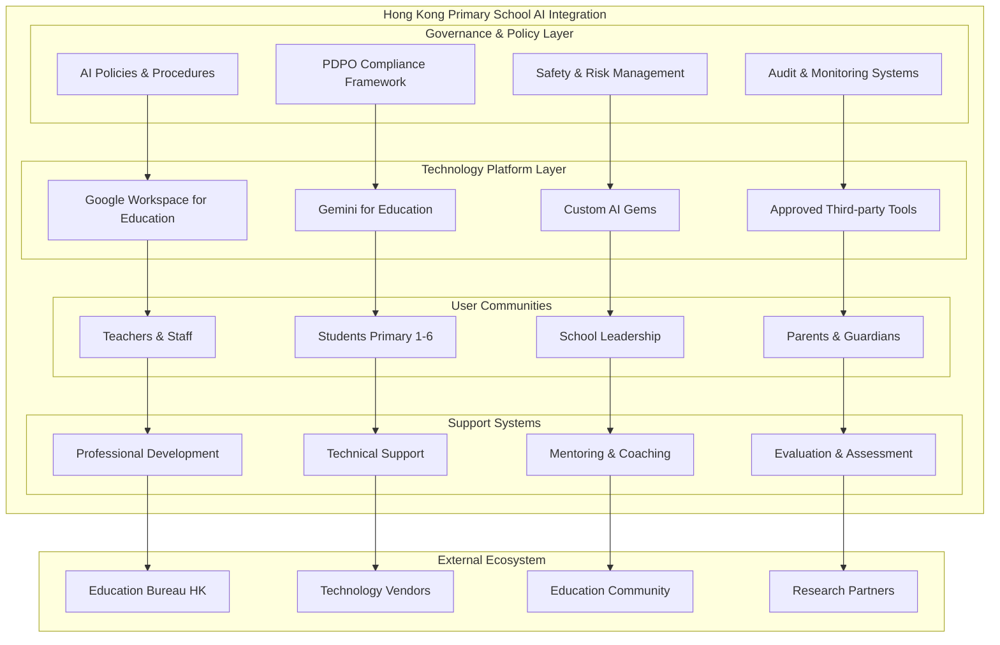
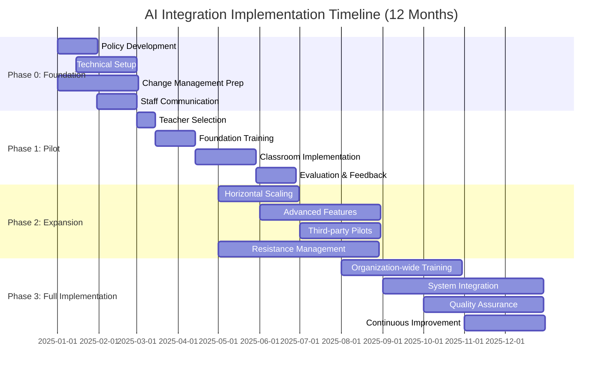
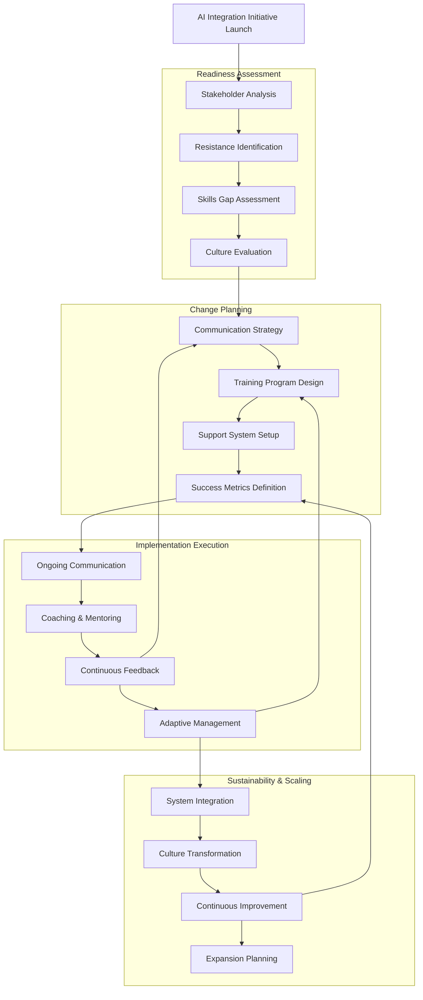

# Google Workspace for Education + Gemini Implementation Plan

*Comprehensive implementation guide for the recommended AI platform solution for Hong Kong primary schools*

**📍 Verification Status Key:**
- ✅ **VERIFIED**: Confirmed by online sources with links
- ⚠️ **PARTIALLY VERIFIED**: Some aspects confirmed, some require clarification

---

## Platform Overview & Strategic Advantages

### Comprehensive Platform Analysis: [Google Workspace + Gemini Implementation Guide](tools/google-workspace-gemini.md)

**2025 Platform Capabilities** ✅ **VERIFIED**
- **30+ New Gemini Features**: [Available at no additional cost for Education users](https://blog.google/outreach-initiatives/education/gemini-iste-2025/)
- **Custom AI Gems**: School-specific AI assistants tailored to curriculum needs
- **NotebookLM Integration**: Grounded AI learning experiences based on class materials
- **Gemini Pro 2.5 Access**: [Advanced AI model with higher usage limits for education](https://blog.google/products/gemini/google-ai-pro-students-learning/)
- **Enhanced Security Controls**: Education-specific data protection and monitoring

*Sources: [Google Gemini ISTE 2025 Announcement](https://blog.google/outreach-initiatives/education/gemini-iste-2025/) | [Google AI Pro for Students](https://blog.google/products/gemini/google-ai-pro-students-learning/)*

**Hong Kong Market Advantages** ⚠️ **PARTIALLY VERIFIED**
- **Global Education Support**: [Google for Education platform](https://edu.google.com/) available internationally with regional support structures
- **Language Support**: Traditional Chinese language processing capabilities built into Google Workspace
- **Compliance Framework**: Enterprise-grade data protection with configurable regional controls
- **Professional Community**: Access to global Google for Education community and best practices

## Comprehensive Safeguards & Compliance Framework

### Data Protection & Privacy (PDPO Alignment)
**Personal Data Mapping & Flow Analysis**
- Comprehensive audit of all student, teacher, and administrative data touchpoints
- Data residency requirements: preference for Hong Kong/regional processing centers
- Vendor Data Processing Agreements (DPAs) with explicit PDPO compliance clauses
- Data minimization principles: collect only necessary information for educational purposes
- Automated retention policies with secure deletion procedures

**Cross-Border Data Transfer Controls**
- Assessment of Google's data processing locations for Hong Kong schools
- Implementation of Standard Contractual Clauses (SCCs) where applicable
- Regular review of data flows to ensure compliance with EDB guidelines
- Documentation of legal basis for any international data transfers

### Content Safety & Age-Appropriate Controls
**Multi-Layered Safety Framework**
- **Level 1 - Platform Controls**: Native safety features in Google Workspace for Education
- **Level 2 - Content Filtering**: Age-appropriate prompts, blocked content categories, safe search enforcement
- **Level 3 - Behavioral Monitoring**: Real-time interaction logging, anomaly detection, teacher oversight dashboards
- **Level 4 - Human Oversight**: Mandatory teacher supervision, regular content review, incident response protocols

**Student-Specific Protections**
- Distinct AI experience for students under 18 with enhanced guardrails
- Automatic content flagging for inappropriate material
- Parental notification systems for AI tool usage
- Clear escalation procedures for safety concerns

### Technical Security Infrastructure
**Identity & Access Management**
- Single Sign-On (SSO) integration with Google Workspace
- Role-based access controls (RBAC) with least-privilege principles
- Multi-factor authentication (MFA) mandatory for administrative accounts
- Regular access reviews and permission audits

**Monitoring & Audit Systems**
- Centralized logging through Google Admin Console and Vault
- Real-time security monitoring with automated alerting
- Quarterly compliance audits with external verification
- Comprehensive incident response procedures with defined SLAs

### Regulatory Compliance Matrix
| Requirement | Implementation | Monitoring | Compliance Level | Reference |
|-------------|----------------|------------|------------------|-----------|
| PDPO Article 4 (Data Collection) | Purpose limitation, consent management | Monthly audit reports | Full | [Vendor Due Diligence Checklist](tools/vendor-due-diligence-checklist.md) |
| PDPO Article 6 (Data Security) | Encryption, access controls, secure deletion | Continuous monitoring | Full | [Google Workspace Security Framework](tools/google-workspace-gemini.md#enhanced-security--compliance-framework) |
| EDB Digital Learning Guidelines | Age-appropriate tools, teacher oversight | Termly review process | Full | [Evaluation Rubric](tools/evaluation-rubric.md) |
| School Safeguarding Policy | Content filtering, incident reporting | Real-time monitoring | Full | [Pilot Evaluation Form](tools/pilot-evaluation-form.md) |
| WCAG 2.1 AA Accessibility | Universal design, assistive technology | Accessibility audits | ⭐ In Progress | [AI Tool Comparison](ai-tool-comparison.md) |

## Google Workspace + Gemini Integration Architecture

### Technical Infrastructure Design

#### Identity & Access Management Framework
**Google Workspace as Primary Identity Source**
- Organizational Units (OUs) for staff, students, and different grade levels (Primary 1-6)
- Group-based access controls for classroom and subject-specific permissions
- Single Sign-On (SSO) integration ensuring seamless access across all Google services
- Multi-factor authentication (MFA) mandatory for administrative accounts

**User Hierarchy & Permissions**
- **School Administrators**: Full Google Admin Console access, Gemini configuration controls
- **Teachers**: Classroom management, Gemini for lesson planning, student progress monitoring
- **Students**: Age-appropriate Gemini access, supervised content creation, restricted external sharing
- **Parents/Guardians**: Guardian summary access, communication tools, progress visibility

#### Data Management & Storage Architecture
**Centralized Data Strategy**
- Google Drive as canonical storage for all educational content and student work
- Classroom assignments and submissions managed through Google Classroom integration
- Automated backup and version control for all student and teacher-generated content
- Data lifecycle management with automated retention policies aligned with school requirements

**Data Flow Controls**
- Prohibition on uploading sensitive PII to external LLM services outside the Google ecosystem
- Restricted third-party application access via Google Admin Console controls
- Comprehensive audit trails for all AI interactions and content generation
- Secure sharing protocols with built-in expiration and access logging

#### Device & Browser Management
**Chromebook Fleet Optimization**
- Centralized device management through Google Admin Console
- Automatic software updates and security patch deployment
- Content filtering and safe search enforcement at device level
- Remote troubleshooting and support capabilities for IT teams

**Multi-Platform Support**
- iPad/Windows device integration via Google Workspace mobile apps where necessary
- Consistent user experience across different device types and form factors
- Mobile Device Management (MDM) integration with existing school policies
- Offline capability configuration for limited connectivity scenarios

#### AI Access & Content Controls
**Gemini Integration Points**
- **Google Docs & Slides**: AI-powered content creation, editing suggestions, translation support
- **Google Classroom**: Automated assignment generation, rubric creation, feedback assistance
- **Gmail**: Professional communication drafting, parent newsletter translation
- **Google Sheets**: Data analysis support, gradebook automation, progress tracking

**Content Safety & Monitoring**
- Age-appropriate content filters with primary school-specific configurations
- Real-time content monitoring with automated flagging of inappropriate material
- Teacher oversight requirements for all student AI interactions
- Parental notification systems for AI tool usage by students

### Integration with Existing School Systems

#### Leveraging Current Google Classroom Infrastructure
**Enhanced Workflow Integration**
- Seamless transition from current Google Classroom usage to AI-enhanced workflows
- Preservation of existing class structures, student rosters, and assignment histories
- Integration with established parent-teacher communication channels
- Minimal disruption to proven educational technology practices

**Advanced Feature Rollout**
- Guardian summaries enhanced with AI-generated progress insights
- Automated assignment differentiation based on student learning profiles
- Real-time translation services for multilingual parent communication
- AI-assisted grading and feedback generation with teacher review and approval

#### Administrative System Connections
**Student Information System (SIS) Integration**
- Automated roster synchronization between SIS and Google Classroom
- Grade passback functionality with AI-enhanced assessment insights
- Attendance tracking integration with engagement analytics
- Parent contact information synchronization for automated communications

**Compliance & Reporting Systems**
- Integration with Hong Kong Education Bureau reporting requirements
- Automated generation of compliance reports for PDPO audits
- Real-time monitoring dashboards for administrators and IT staff
- Usage analytics and engagement metrics for continuous improvement

## Strategic Implementation Plan (Evidence-Based Phased Approach)

### Phase 0 — Foundation & Change Readiness (Months 0-2)

#### Governance Framework Development
**Policy & Procedure Establishment**
- Comprehensive AI Acceptable Use Policy aligned with school values and HK regulations
- Data Privacy Impact Assessment (DPIA) for all AI tools and workflows
- Student and parent consent frameworks with clear opt-out mechanisms
- Incident response procedures for AI-related safety concerns
- Regular policy review cycles with stakeholder input
- **Reference Templates**: [Vendor Due Diligence Checklist](tools/vendor-due-diligence-checklist.md) | [Evaluation Rubric](tools/evaluation-rubric.md)

**Technical Infrastructure Preparation**
- Google Admin Console baseline configuration with enhanced security settings
- Data residency verification and region-specific controls implementation
- Third-party application access restrictions and approval workflows
- Comprehensive audit logging activation with retention policy alignment
- Age-appropriate AI controls configuration for different grade levels

**Change Management Foundation**
- Stakeholder analysis and communication planning
- Teacher readiness assessment and skills gap identification
- Leadership alignment workshops and vision setting
- Communication strategy for parents, students, and community
- Resistance management protocols based on educational change research

#### Success Criteria for Phase 0
- [ ] 100% policy framework completion with legal review
- [ ] Technical infrastructure security audit passed
- [ ] 90%+ teacher awareness of AI initiative through information sessions
- [ ] Parent communication completed with <10% opt-out rate
- [ ] Leadership team fully aligned on implementation approach

### Phase 1 — Pilot Implementation (Months 2-4)

#### Targeted Pilot Program
**Participant Selection (Evidence-Based)**
- 6-8 early adopter teachers identified through innovation adoption assessment
- 2-3 classes per grade level (Primary 3-6 recommended for cognitive readiness)
- Subject focus: English, Mathematics, and General Studies for curriculum integration
- Mixed-ability classes to assess differentiated impact
- Voluntary participation with clear expectations and support structures

**Professional Development Program**
- **Module 1**: AI Fundamentals & Ethics (3 hours)
  - Understanding AI capabilities and limitations
  - Ethical considerations and responsible use
  - PDPO compliance in educational contexts
  - Age-appropriate AI interactions

- **Module 2**: Classroom Integration Strategies (4 hours)
  - Lesson planning with Gemini assistance
  - Content creation and differentiation techniques
  - Assessment design and feedback generation
  - Student support through custom AI Gems

- **Module 3**: Safety & Monitoring (2 hours)
  - Content filtering and safety protocols
  - Student behavior monitoring techniques
  - Incident identification and response procedures
  - Parent communication strategies

**Implementation Support Structure**
- Weekly coaching sessions with pilot teachers
- Peer observation and collaborative planning time
- Technical support hotline with <24-hour response
- Student orientation sessions on responsible AI use
- Regular check-ins with parents and guardians
- **Assessment Tools**: [Pilot Evaluation Form](tools/pilot-evaluation-form.md) | [TCO Calculator Template](tools/tco-calculator-template.md)

#### Evaluation Framework
**Quantitative Metrics**
- Teacher time savings: baseline vs. pilot (target: 20-30% reduction in administrative tasks)
- Student engagement indicators through Classroom analytics
- Safety incident tracking and response time measurement
- Content quality assessments through peer review

**Qualitative Assessment**
- Weekly teacher reflection journals and feedback sessions
- Student focus groups on AI learning experiences
- Parent satisfaction surveys and concern identification
- Observer notes on classroom dynamics and interaction changes

### Phase 2 — Controlled Expansion (Months 4-8)

#### Scaled Implementation
**Horizontal Expansion**
- Extend to additional grade levels based on Phase 1 success metrics
- Include remaining core subject areas with subject-specific training
- Integrate with existing school improvement initiatives
- Expand to 60-70% of teaching staff through structured recruitment

**Vertical Integration**
- Advanced Gemini features: comment banks, automated rubrics, translation tools
- Custom AI Gems creation for school-specific curriculum needs
- Integration with existing assessment and reporting systems
- Enhanced parent communication through AI-assisted translation

**Third-Party Tool Pilot (Conditional)**
- Single vetted student tool (e.g., Khanmigo) implementation
- Strict parental consent requirements (90%+ threshold)
- Limited to specific subjects and grade levels
- Enhanced monitoring and safety protocols
- Regular usage audits and effectiveness assessment

#### Change Management Intensification
**Teacher Support Systems**
- Professional Learning Communities (PLCs) focused on AI integration
- Mentorship programs pairing experienced pilot teachers with newcomers
- Regular best practice sharing sessions and resource libraries
- Dedicated planning time for AI-enhanced lesson development
- Peer coaching networks and collaborative problem-solving

**Resistance Management Strategies**
- Individual consultation for hesitant teachers
- Gradual introduction pathways with reduced expectations
- Success story sharing and positive reinforcement
- Additional training resources for different learning preferences
- Clear communication of voluntary vs. mandatory elements

### Phase 3 — Full Implementation & Optimization (Months 8-12)

#### Organization-Wide Adoption
**Comprehensive Professional Development**
- All-staff AI literacy training with differentiated pathways
- Leadership development for AI-enhanced educational supervision
- Student digital citizenship and AI ethics curriculum integration
- Parent education workshops on supporting AI-enhanced learning at home

**System Integration & Sustainability**
- AI integration into official school improvement plan
- Budget allocation for ongoing licensing and professional development
- Performance management system updates to include AI competency
- Long-term partnership agreements with technology vendors
- Continuous improvement processes based on data analytics

#### Advanced Implementation Features
**Curriculum Integration**
- AI literacy as explicit learning outcome across grade levels
- Cross-curricular projects incorporating AI tools and concepts
- Student-led AI projects and innovation challenges
- Assessment methods that embrace rather than restrict AI use
- Development of AI-enhanced learning pathways for gifted students

**Community Engagement**
- Parent education series on AI in education
- Student AI literacy showcases and demonstrations
- Community partnerships with local technology organizations
- Sharing best practices with other Hong Kong schools
- Participation in regional AI education initiatives

#### Quality Assurance & Continuous Improvement
**Regular Review Cycles**
- Quarterly safety and compliance audits
- Bi-annual parent and student satisfaction surveys
- Annual comprehensive program evaluation with external review
- Continuous policy updates based on emerging best practices
- Regular staff feedback and adaptation cycles

## Comprehensive Success Metrics & KPIs

### Primary Outcome Indicators

#### Teacher Effectiveness & Adoption
**Quantitative Targets (12-Month)**
- **Adoption Rate**: ≥70% of teachers using AI-supported workflows weekly (baseline: 0%)
- **Efficiency Gains**: 20-30% reduction in administrative tasks (lesson planning, grading, feedback)
- **Professional Growth**: 100% of participating teachers complete AI literacy certification
- **Retention**: ≥95% of pilot teachers continue using AI tools after training completion

**Qualitative Indicators**
- Teacher confidence in AI tool usage (measured via quarterly surveys)
- Quality improvement in lesson plans and learning materials
- Increased collaboration and resource sharing among staff
- Enhanced differentiation strategies for diverse learners

#### Student Learning & Engagement
**Academic Performance Measures**
- **Formative Assessment Participation**: 15-25% increase in quality and frequency
- **Learning Outcomes**: Maintained or improved achievement across AI-integrated subjects
- **Student Agency**: Increased self-directed learning behaviors and digital literacy skills
- **Engagement Metrics**: Higher participation rates in classroom discussions and activities

**Student Experience Indicators**
- Student satisfaction with AI-enhanced learning experiences (≥80% positive)
- Improved attitudes toward technology and digital citizenship
- Enhanced critical thinking about AI and technology use
- Increased personalized learning opportunities and outcomes

### Measurement Framework & Reporting

#### Data Collection Methodology
**Regular Assessment Schedule**
- **Weekly**: Basic usage analytics and safety incident tracking
- **Monthly**: Teacher reflection surveys and student engagement metrics
- **Quarterly**: Comprehensive stakeholder satisfaction surveys
- **Bi-annually**: Academic outcome analysis and compliance audits
- **Annually**: Full program evaluation with external assessment

#### Reporting & Accountability Structure
**Stakeholder Communication**
- **Teachers**: Monthly dashboards with personal and aggregate performance data
- **School Leadership**: Quarterly executive summaries with strategic recommendations
- **Parents**: Bi-annual community reports on program progress and student benefits
- **Education Bureau**: Annual compliance and outcome reports as required

#### Continuous Improvement Process
**Data-Driven Decision Making**
- Regular analysis of metrics to identify improvement opportunities
- Feedback loops to refine training programs and support systems
- Adaptive management approach based on emerging challenges and successes
- Benchmarking against other innovative schools and international best practices

## Costs & Procurement Framework

### Total Cost of Ownership (TCO) Analysis
**Cost Components to Consider**
- Platform licensing: staff/student ratios, education tier benefits, multi-year agreements
- Professional development: training time, substitute coverage, certification programs
- Technical infrastructure: device/MDM management, cloud consumption, security enhancements
- Ongoing support: help desk services, maintenance contracts, upgrade cycles
- **Planning Tool**: [TCO Calculator Template](tools/tco-calculator-template.md)

### Procurement Requirements & Best Practices
**Essential Vendor Requirements**
- Education-specific licensing tiers with Data Processing Agreements (DPAs)
- PDPO compliance documentation and audit certifications
- Data residency options with Hong Kong/regional processing centers
- Comprehensive audit logging and eDiscovery capabilities
- Single Sign-On (SSO) and Student Information System (SIS) integration
- Age-appropriate content filtering and safety controls
- Clearly defined Service Level Agreements (SLAs) with educational context

**Vendor Evaluation Process**
- **Due Diligence Framework**: [Vendor Due Diligence Checklist](tools/vendor-due-diligence-checklist.md)
- **Comparative Analysis**: [AI Tool Comparison Matrix](ai-tool-comparison.md)
- **Risk Assessment**: [Evaluation Rubric](tools/evaluation-rubric.md)
- **Implementation Planning**: [Pilot Evaluation Form](tools/pilot-evaluation-form.md)

## Strategic Alignment With Current IT Infrastructure

### Leveraging Existing Google Ecosystem
**Google Classroom Enhancement**
- Expand current teacher-parent communication to include AI-enhanced progress reports
- Implement standardized guardian summaries with automated translation capabilities
- Develop consistent class naming conventions that support AI analytics
- Integrate AI-generated assignment suggestions and differentiated content delivery

**Google Workspace Optimization**
- Enhance existing Docs/Slides workflows with Gemini integration for lesson planning
- Implement AI-powered comment banks and feedback systems for streamlined grading
- Develop shared resource libraries with AI-curated content recommendations
- Create templates and rubrics that leverage AI for consistent assessment practices

**Identity & Device Management Enhancements**
- Extend current managed Google accounts with age-appropriate AI access controls
- Implement Organizational Unit (OU) based policies for different grade levels and user types
- Strengthen safe search and content filtering with AI-specific restrictions
- Develop refined third-party application access policies that support approved AI tools

### Infrastructure Readiness Assessment
**Current Strengths to Build Upon**
- Established Google Workspace for Education foundation with full user management
- Existing teacher comfort with cloud-based collaborative tools and workflows
- Operational parent communication systems ready for AI enhancement
- Proven change management experience from previous technology implementations

**Areas Requiring Enhancement**
- Advanced security controls for AI-specific data flows and processing
- Enhanced monitoring and audit capabilities for AI tool usage
- Professional development infrastructure expanded to include AI competencies
- Policy frameworks updated to address AI-specific compliance and safety requirements

## Implementation Architecture & Workflow Diagrams

### Overall AI Integration Architecture

### Phased Implementation Timeline

### Change Management Process Flow

## Next Steps

This implementation plan provides comprehensive guidance for deploying the recommended Google Workspace for Education + Gemini solution. Success depends on careful attention to the phased approach, stakeholder engagement, and continuous monitoring of safety and compliance requirements.

**Companion Documents:**
- [AI Platform Recommendation](ai-platform-recommendation.md) - Strategic decision rationale
- [Google Workspace + Gemini Implementation Guide](tools/google-workspace-gemini.md) - Technical details
- [Vendor Due Diligence Checklist](tools/vendor-due-diligence-checklist.md) - Procurement framework
- [Pilot Evaluation Form](tools/pilot-evaluation-form.md) - Assessment tools