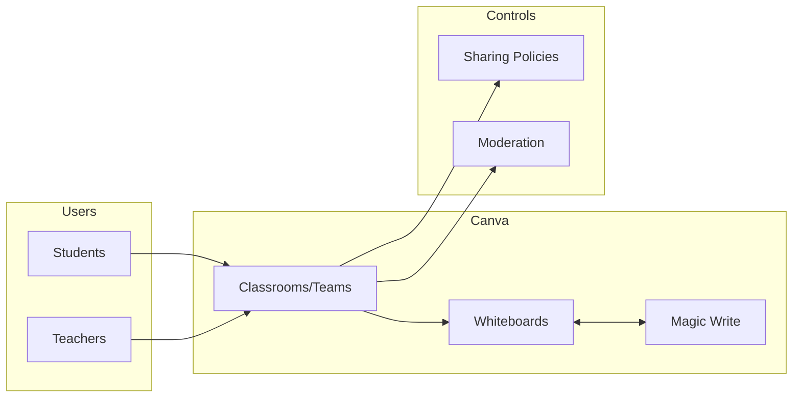

# Canva for Education

## Overview
Canva for Education is a free K–12 plan offering templates, whiteboards, and multimedia creation with education-specific controls. AI features (e.g., Magic Write) assist with drafting and layout.

## Primary School Fit
- Visual learning, posters, storyboards, and collaborative whiteboards.
- Easy onboarding for young learners with classroom spaces.

## Safeguards & Compliance
- Teacher-managed classes; moderation and sharing controls.
- Configure content filters and restrict external sharing.
- Use SSO and ensure class membership is current.
- PDPO alignment: minimize student PII; confirm data residency/retention with vendor and document
  controls against DPP1–DPP6.

## Setup & Integration
- SSO via Google/Microsoft; import classes from LMS where supported.
- Create class teams, assign templates, and lock sensitive elements.

## Pricing & Licensing
- Free for verified K–12 educators and students. Confirm eligibility for your school.

## Classroom Scenarios
- Create bilingual posters; collaborative mind maps; reflective journals.
- Teacher-generated templates for differentiated tasks.

## Configuration Checklist
- [ ] Enable SSO and verify educator accounts
- [ ] Limit external sharing; set class-only defaults
- [ ] Review AI feature controls per age group

## Diagrams

Back to comparison: [AI Tool Comparison](../ai-tool-comparison.md)
