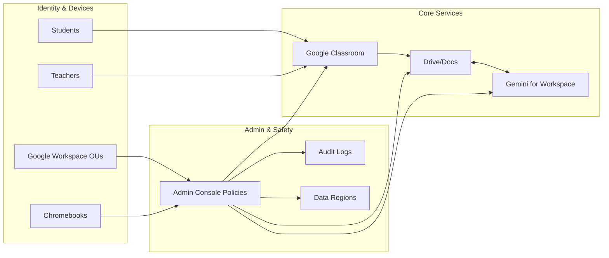

# Google Workspace for Education + Gemini

## Overview
Google Workspace for Education provides Classroom, Docs, Drive, and Admin controls. Gemini for Workspace adds AI-assisted drafting, feedback, and lesson planning inside familiar apps.

## Primary School Fit
- Integrated with Classroom for assignments and feedback.
- Low-friction for Chromebooks and browser-based workflows.
- Bilingual environments supported (English/Chinese documents, translation aids).

## Safeguards & Compliance
- Admin: enforce safe search, restrict external sharing, apply data regions where available.
- Disable data sharing for model training where applicable; use least-privilege roles.
- Log access/events; review termly for PDPO compliance.

## Setup & Integration
- Identity: Google Workspace as source of truth; OU-based policies for staff/students.
- Devices: manage Chromebooks via Admin console; apply web filters.
- Classroom: auto-rostering via SIS sync or CSV; use rubrics and comment banks.

## Pricing & Licensing
- Fundamentals: free; paid tiers add security and teaching features.
- Gemini add-ons available for eligible EDU tiers; verify current EDU availability and terms.

## Classroom Scenarios
- Draft lesson outlines and differentiated materials in Docs.
- Provide rubric-aligned feedback suggestions; translate parent notices.

## Configuration Checklist
- [ ] Set data regions and sharing restrictions
- [ ] Disable data-sharing for model improvement if available
- [ ] Turn on audit logs and set retention
- [ ] Configure Classroom guardian summaries and class-level policies

## Diagrams

