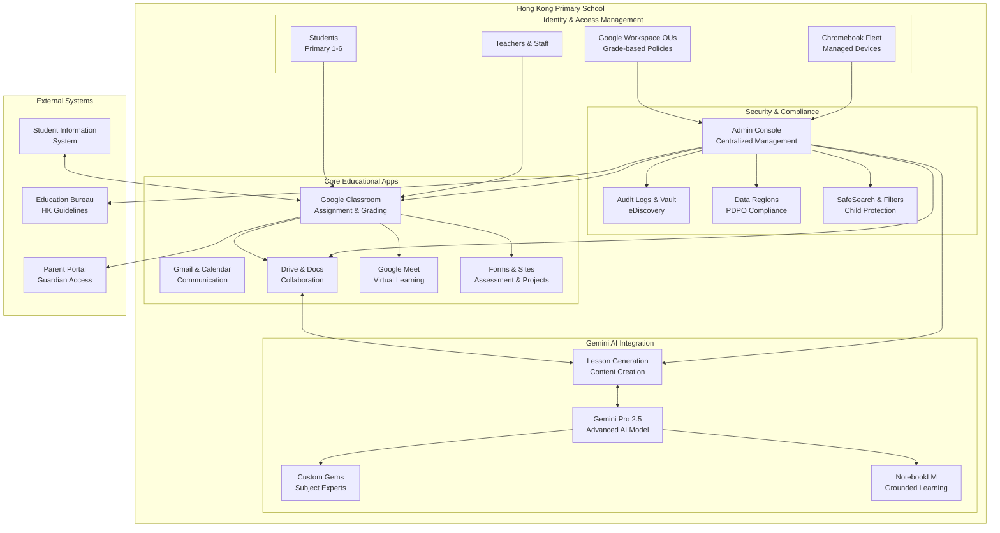
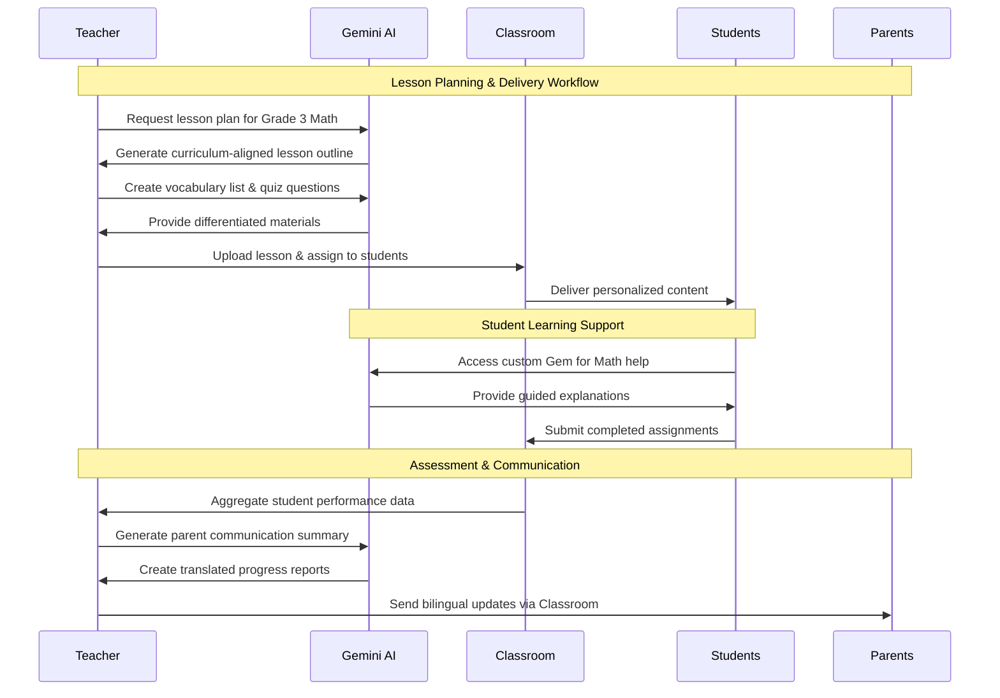
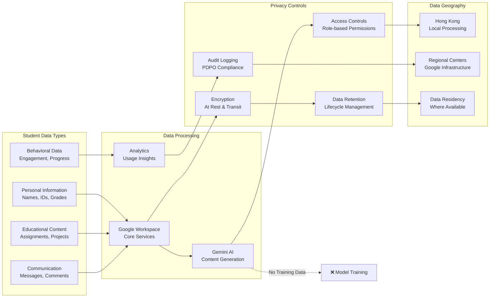

# Google Workspace for Education + Gemini

## Overview
Google Workspace for Education provides a comprehensive suite of educational tools including Classroom, Docs, Drive, Meet, Gmail, and Admin controls. Gemini for Education adds AI-powered features for lesson planning, content creation, and personalized learning experiences, built specifically for the unique needs of the educational community.

## Edition Tiers & Features

### Education Fundamentals (Free)
- **Core Apps**: Classroom, Google Meet, Docs, Sheets, Slides, Forms, Gmail, Drive, Sites, Chat, Calendar
- **Storage**: 100 TB pooled cloud storage shared across organization
- **Security**: Basic user management, 2-step verification, automated virus/spam protection
- **Admin Tools**: Google Admin console with basic management features
- **Availability**: Free for qualified educational institutions globally, including Hong Kong

### Education Standard (Paid - per student enrollment)
- **All Fundamentals features** plus:
- **Advanced Security**: Enhanced security analytics, security center, advanced threat protection
- **Administrative Controls**: eDiscovery tools, audit reports, enhanced user management
- **Support**: 24/7 customer support
- **Licensing**: One staff license for every four student licenses purchased
- **Data Protection**: Institutional data protection with security analytics

### Education Plus (Premium)
- **All Standard features** plus:
- **Advanced Teaching Tools**: Enhanced video features, advanced Meet capabilities
- **Analytics**: Detailed usage and engagement analytics
- **Premium Support**: Priority support and training resources

### Google AI Pro for Education (New for 2025)
- **Launch Date**: Available from September 1, 2025
- **Features**: All advanced AI features previously in Gemini Education Premium at reduced pricing
- **Premium AI Models**: Access to Gemini 2.5 Pro with significantly higher usage limits

## Gemini for Education Capabilities

### AI-Powered Teaching Tools
- **Lesson Planning**: Generate first drafts of lesson plans by providing target grade and topic
- **Content Creation**: Create vocabulary lists with definitions and example sentences
- **Assessment Tools**: Generate draft quizzes based on learning objectives, exportable to Google Forms
- **Video Integration**: Get suggestions for relevant educational videos
- **Differentiated Materials**: Create personalized content for different student needs

### Classroom Integration Features (Free for All Educators)
- **30+ New Features**: Available at no cost to all Google Workspace for Education users
- **Brainstorming Support**: AI-assisted idea generation for teaching activities
- **Content Personalization**: Adapt materials for different learning styles and abilities
- **Rubric-Aligned Feedback**: Generate suggestions aligned with learning objectives

### Student-Focused AI Features
- **Custom Gems**: Teachers create AI experts tailored to specific subjects or topics
- **NotebookLM Integration**: Assign AI notebooks grounded in class materials directly through Classroom
- **Guided Learning**: AI tutors that provide extra support for struggling students
- **Teacher-Led Experiences**: All student AI interactions managed and supervised by educators

## Primary School Fit in Hong Kong Context

### Pedagogical Advantages
- **Bilingual Support**: Seamless English/Chinese document creation and translation aids
- **Chromebook Integration**: Low-friction deployment on school-managed devices
- **Curriculum Alignment**: Tools support Hong Kong primary curriculum requirements
- **Collaborative Learning**: Real-time collaboration supports group projects and peer learning

### Cultural & Administrative Fit
- **Familiar Interface**: Browser-based workflows align with existing IT infrastructure
- **Auto-Rostering**: SIS sync or CSV import for Hong Kong school management systems
- **Guardian Communication**: Built-in parent/guardian notification systems with translation support
- **Assessment Tools**: Digital rubrics and comment banks support local assessment practices

## Enhanced Security & Compliance Framework

### Data Protection Measures
- **No Advertising**: Zero ads in education core services, no personal data used for advertising
- **Model Training Opt-out**: Student and teacher data not used to improve AI models
- **Enterprise-Grade Protection**: Advanced data loss prevention and threat detection
- **Regional Data Controls**: Available data residency options where applicable

### PDPO Compliance Features
- **Audit Logging**: Comprehensive access and event logging with configurable retention
- **Data Minimization**: Least-privilege access controls and organizational unit policies
- **External Sharing Controls**: Granular restrictions on document sharing outside organization
- **Consent Management**: Administrative controls for managing data sharing permissions

### Child Safety Protections
- **Age-Appropriate Content**: Distinct product experience for students under 18 with extra guardrails
- **Content Filtering**: AI identifies and blocks inappropriate content for younger users
- **Safe Search**: Enforced safe search across all Google services
- **Administrative Oversight**: Complete admin control over AI feature access and usage

## Advanced Setup & Integration

### Identity Management
- **Single Source of Truth**: Google Workspace as primary identity provider
- **Organizational Units**: Separate policies for staff, students, and different grade levels
- **Multi-Factor Authentication**: Required 2-step verification for administrative accounts
- **Role-Based Access**: Granular permissions based on user roles and responsibilities

### Device Management
- **Chromebook Fleet**: Centralized management through Admin console
- **Web Filtering**: School-appropriate content filtering and monitoring
- **App Management**: Control over which applications students can access
- **Remote Administration**: IT teams can manage devices remotely for troubleshooting

### Classroom Automation
- **SIS Integration**: Direct sync with Hong Kong student information systems
- **Automated Rostering**: Students automatically enrolled in appropriate classes
- **Grade Passback**: Seamless integration with existing grade book systems
- **Guardian Summaries**: Automated parent/guardian notifications with progress updates

## 2025 Pricing & Licensing Updates

### New Licensing Model
- **Unified License**: Single license type for Education Standard and Education Plus
- **Implementation Timeline**: Changes take effect no sooner than October 1, 2025
- **Flexible Plans**: Existing customers can maintain current pricing until transition date
- **Hong Kong Pricing**: Business pricing starts at HKD 45/user/month (education pricing differs)

### Cost Considerations for Hong Kong Schools
- **Fundamentals**: Completely free for qualified institutions
- **Standard/Plus**: Per-student enrollment pricing model
- **Staff Licensing**: 1:4 ratio (one staff license per four student licenses)
- **AI Features**: Many Gemini capabilities included at no additional cost

## Expanded Classroom Scenarios

### Lesson Development Workflow
1. **Planning**: Use Gemini to generate lesson outlines for specific grade levels and topics
2. **Content Creation**: Generate vocabulary lists, reading comprehension questions, and activities
3. **Resource Integration**: AI suggests relevant videos and supplementary materials
4. **Assessment Design**: Create formative and summative assessments aligned with learning objectives
5. **Differentiation**: Adapt materials for students with different learning needs

### Student Support Scenarios
- **Personalized Tutoring**: Custom AI Gems provide subject-specific support
- **Language Learning**: Bilingual content creation and translation for ESL students
- **Special Needs**: Adaptive content generation for students with learning differences
- **Gifted Programs**: Advanced challenge activities and enrichment materials

### Administrative Efficiency
- **Parent Communication**: Automated translations of school notices and progress reports
- **Professional Development**: AI-assisted creation of teacher training materials
- **Policy Documentation**: Generate and maintain school policy documents
- **Data Analysis**: Insights into student engagement and learning outcomes

## Comprehensive Configuration Checklist

### Initial Setup
- [ ] Verify educational institution qualification for free Fundamentals tier
- [ ] Configure organizational units for different user types (staff/students/grades)
- [ ] Set up appropriate data regions and residency controls
- [ ] Establish external sharing restrictions and policies
- [ ] Configure safe search and content filtering settings

### Security Configuration
- [ ] Enable 2-step verification for all administrative accounts
- [ ] Disable data sharing for AI model improvement (where available)
- [ ] Configure audit logging with appropriate retention periods
- [ ] Set up security alerts and monitoring
- [ ] Implement least-privilege access controls

### Classroom Integration
- [ ] Configure SIS integration or CSV import processes
- [ ] Set up auto-rostering for current academic year
- [ ] Create class-level policies and guardian notification settings
- [ ] Configure rubrics and comment banks for consistent assessment
- [ ] Test Gemini AI features with pilot teacher group

### Ongoing Management
- [ ] Schedule quarterly PDPO compliance reviews
- [ ] Monitor usage analytics and engagement metrics
- [ ] Conduct regular security audits and updates
- [ ] Provide ongoing teacher training on new AI features
- [ ] Review and update policies based on educational needs

## Hong Kong Implementation Considerations

### Regulatory Compliance
- **PDPO Alignment**: Ensure all data handling meets Personal Data Privacy Ordinance requirements
- **Education Bureau Guidelines**: Comply with Hong Kong Education Bureau digital learning policies
- **Cross-Border Data**: Understand implications of data processing outside Hong Kong
- **Incident Response**: Establish procedures for data breaches or security incidents

### Cultural Adaptation
- **Traditional Chinese Support**: Full support for Traditional Chinese character input and display
- **Local Holiday Calendar**: Integration with Hong Kong school calendar and holidays
- **Parental Expectations**: Communication features that meet local parent engagement expectations
- **Assessment Practices**: Tools that support Hong Kong's assessment and examination systems

## Implementation Architecture Diagrams

### Overall System Architecture

### AI Workflow Integration

### Data Flow & Privacy Controls

