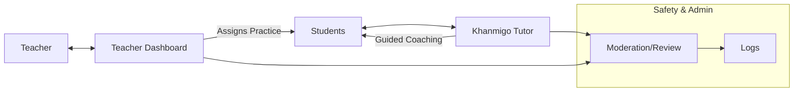

# Khan Academy Khanmigo

## Overview
Khanmigo is Khan Academy’s AI tutor/coach integrated with standards-aligned content. It supports student practice with guidance and provides teacher dashboards for oversight.

## Primary School Fit
- Age-appropriate coaching aligned to math and literacy curricula.
- Teacher controls and visibility into student conversations.

## Safeguards & Compliance
- Student accounts under school/district tenancy; moderated interactions.
- Classroom management features to review and flag content.
- Data processing agreements available for schools; confirm region and retention.
- PDPO alignment: verify data residency/transfer terms, retention, and access logs with vendor;
  avoid storing unnecessary student PII (DPP1–DPP6).

## Setup & Integration
- Rostering via SSO (Google/Microsoft) and standard roster tools; class imports.
- Sync classes to teacher dashboards; enable student-friendly prompts.

## Pricing & Licensing
- School/district licensing. Confirm EDU pricing and availability for HK.

## Classroom Scenarios
- Socratic guidance on problem-solving steps; reading comprehension coaching.
- Teacher assigns targeted practice; uses coach transcripts for feedback.

## Configuration Checklist
- [ ] Enable SSO and class rostering
- [ ] Turn on classroom moderation/review features
- [ ] Share student conduct and privacy guidelines

## Diagrams

Back to comparison: [AI Tool Comparison](../ai-tool-comparison.md)
