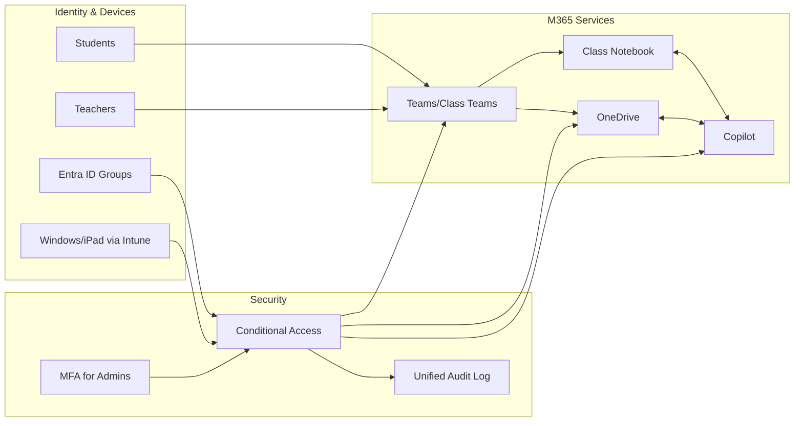

# Microsoft 365 Education + Copilot

## Overview
Microsoft 365 Education provides Teams, OneDrive, Class Notebook, and Entra ID-based controls. Copilot brings AI assistance into Word, PowerPoint, Teams, and more, leveraging existing school data boundaries.

## Primary School Fit
- Strong for Windows and iPad fleets with Intune/Jamf.
- Class Teams and OneNote Class Notebook align with teacher workflows.

## Safeguards & Compliance
- Entra ID SSO, conditional access, MFA for admins.
- Intune policies for device compliance and content filtering.
- Copilot respects M365 permissions; configure data access and logging.

## Setup & Integration
- Identity: Entra ID groups for staff/students/classes.
- Devices: Intune for Windows/iPad; enforce compliance and browser safety.
- LMS: integrate with Class Teams; sync classes via SDS/CSV.

## Pricing & Licensing
- EDU SKUs for M365; Copilot available as an add-on for eligible EDU plans. Confirm current availability and terms.

## Classroom Scenarios
- Draft lesson plans and differentiate reading passages in Word.
- Generate rubrics and practice questions; summarize class discussions in Teams.

## Configuration Checklist
- [ ] Conditional access for admins; MFA enforced
- [ ] Intune baseline for student devices
- [ ] Copilot service settings aligned to data-access policies
- [ ] Audit logging and retention configured

## Diagrams

