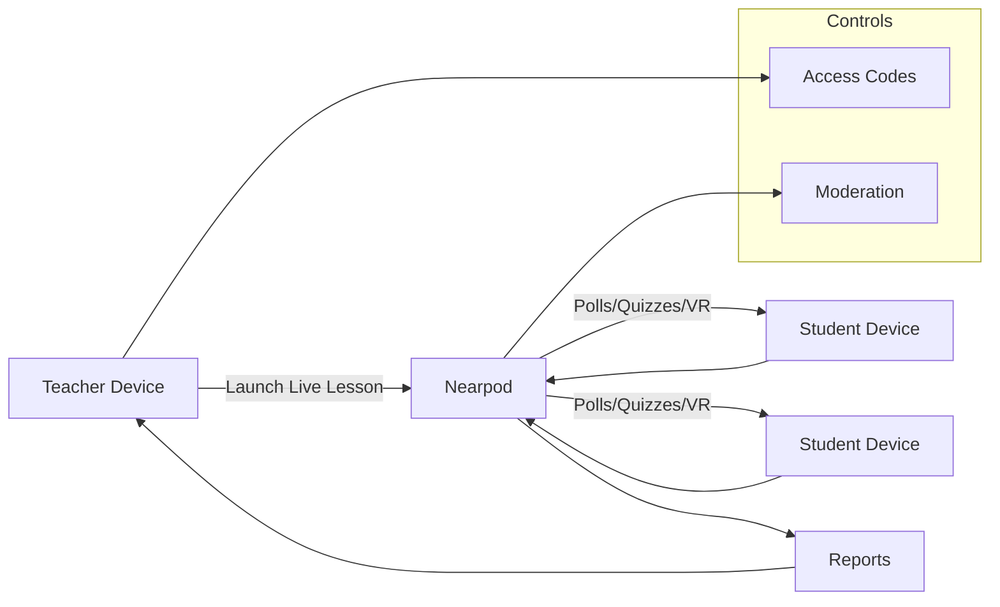

# Nearpod

## Overview
Nearpod delivers interactive lessons, polls, quizzes, VR content, and student-paced modules. AI features assist with lesson creation and formative checks.

## Primary School Fit
- Whole-class engagement with live participation.
- Wide library of age-appropriate content and activities.

## Safeguards & Compliance
- Teacher controls session access and pacing; join via codes.
- Student responses visible to teacher; moderation options available.
- Use SSO and limit external sharing of student work.
- PDPO alignment: confirm vendor data residency and retention; minimize PII in activities and
  document safeguards against DPP1–DPP6.

## Setup & Integration
- SSO/LMS integrations available; import rosters where supported.
- Embed activities in existing lesson flows; enable student-paced for homework.

## Pricing & Licensing
- Free/basic options; premium school/district plans add features and reporting.

## Classroom Scenarios
- Interactive read-alouds, polls for comprehension checks, and VR field trips.
- Generate quick quizzes from lesson objectives.

## Configuration Checklist
- [ ] Enable SSO and class/roster sync
- [ ] Restrict sessions to classroom participants
- [ ] Review AI-generated content for suitability

## Diagrams

Back to comparison: [AI Tool Comparison](../ai-tool-comparison.md)
