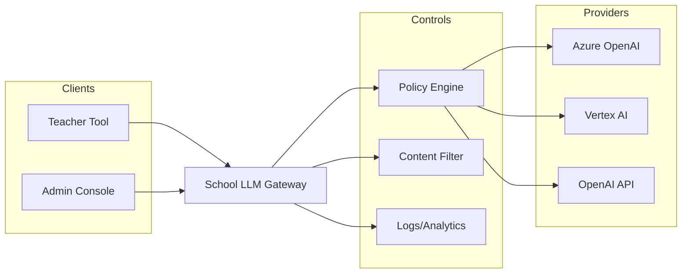

# Private LLM Gateway (Azure/OpenAI/GCP managed)

## Overview
A school-controlled gateway fronts cloud LLM providers (e.g., Azure OpenAI Service, Google Vertex AI, OpenAI API) to enforce data residency, logging, rate limits, and content filtering before requests reach providers.

## Why This Pattern
- Centralizes controls and audit logs for PDPO compliance.
- Allows safe experimentation with prompts and custom workflows without exposing keys to classrooms.

## Safeguards & Controls
- Data: select regions; avoid storing student PII; optionally mask/redact PII server-side.
- Safety: apply content filters/toxicity checks; blocklists/allowlists for prompts.
- Identity: SSO for teachers; per-user or per-app API keys; role-based quotas.
- Logging: capture prompts/responses; retention and access policies.

## Reference Stack
- API layer (e.g., lightweight Node/Python service) with provider clients (Azure/OpenAI/Vertex AI).
- Policy engine (e.g., JSON policies) for model, max tokens, safety settings, and cost caps.
- Storage for logs/metrics; dashboard for audits.

## Deployment & Integration
- Host on approved cloud (Azure/GCP); lock region; private networking where feasible.
- Integrate with LMS/Classroom via add-ons or web apps; never expose provider keys to client.

## Costs & Licensing
- Cloud usage costs per-token/character plus hosting/ops overhead.
- Start with strict quotas; monitor with monthly budgets and alerts.

## Classroom Scenarios
- Teacher-only tools: rubric generator, lesson plan drafts, translation support.
- Controlled student access for guided writing tasks with strong filters.

## Configuration Checklist
- [ ] Choose primary provider/region; document data flows
- [ ] Implement PII redaction and content filters
- [ ] Enforce SSO, roles, quotas; rotate keys
- [ ] Enable detailed logging and retention; runbooks for incidents

## Diagrams

Back to comparison: [AI Tool Comparison](../ai-tool-comparison.md)
